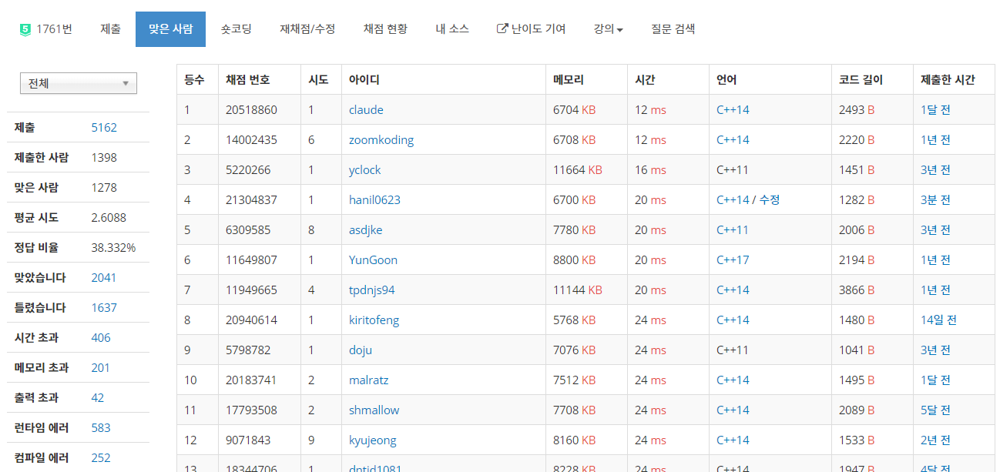

## 알고리즘 - LCA 1, 2 :evergreen_tree: 

 ##### 1. 간선의 정보를 알 때 양방향으로 adjList(nostl)을 구성하는 방법
    - 범위를 두 배 설정 후, n+1부터 방향이 바뀐 인풋이 온다고 생각
```
    for(int i=1; i<=n; i++){
        cin >> e[i].s >> e[i].t;
        e[i].prv = l[e[i].s];
        l[e[i].s] = i;

        // 양방향
        e[n+i].s = e[i].t;
        e[n+i].t = e[i].s;
        e[n+i].prv = l[e[n+i].s];
        l[e[n+i].s] = n+i;
    }
```

 ##### 2. 전처리 배열 개념 dth[i], p[i][j](희소 행렬)

    - dth[i] : i번 노드의 depth (root : 1)
    - p[i][j] : i번 노드의 2^j번째 조상의 노드
    - 위 노드를 통해 쿼리당 O(logn)에 LCA를 알아낼 수 있다.


 ##### 3. dfs 함수와 lca 함수 개념

```
    1. dfs로 dth 배열을 전처리
    // dth[root] = 1;
    void dfs(int v){
        for(int i=l[v]; i; i = e[i].prv){
            int u = e[i].t;
            if(dth[u]) continue;
            dth[u] = dth[e[i].s] + 1;
            p[u][0] = e[i].s;
            dfs(e[i].t);
        }
    }

    2. 희소 행렬 전처리
    for(int i=1; i<=19(2^19, n); i++){
        for(int j=1; j<=n; j++){
            p[j][i] = p[p[j][i-1]][i-1];
        }
    }

    3. lca로 공통 조상의 number return
    int lca(int u, int v){
        // u를 depth가 높게 맞춰줌
        if(dth[u] < dth[v]) swap(u, v);

        // u와 v의 depth를 맞춰줌
        for(i = 19; i>=0; i--){
            if(dth[u] - dth[v] >= (1 << i)){
                u = p[u][i];
            }
        }

        // depth를 맞출때 서로가 같다면 조상인거임
        if(u == v) return u or v;
        
        // 아니면 dth[lca-1]까지 높이를 맞춰준다.
        for(i = 19; i>=0; i--){

            // 높이는 같은데 공통조상이 다르다면 u,v를 옮긴다.
            if(p[u][i] != p[v][i]){
                u = p[u][i];
                v = p[v][i];
            }
        }
        // dth[lca-1]까지 왔다면 조상을 리턴
        return p[u][0];
    }
```

## 알고리즘 - 정점들의 거리

 - 위 LCA 원리를 응용하면 된다.

 - 간선의 가중치가 나오고, 특정 노드에서 특정 노드까지의 거릿값을 구하는 문제이다.

 - 응용의 핵심은 s[i] 배열을 선언하고 prefix sum 형식으로 녹여내는것
    + s[i] : 루트에서 i번 노드까지의 가중치 합의 최솟값

 - 이를 dfs 함수에 녹여내어 s[i] 배열을 전처리한다.

 - 이후, lca를 통한 조상을 구한 후 s[a] - s[b] - 2*s[anc] 하면 답!

```
 void dfs(int u) {
	for (int i = l[u]; i; i = e[i].prv) {
		int v = e[i].t;
		if (dth[v]) continue;
		if (s[v]) continue;
		s[v] = s[e[i].s] + e[i].w;
		dth[v] = dth[e[i].s] + 1;
		p[v][0] = e[i].s;
		dfs(v);
	}
}
```
 - ##### 1278명 중 4등! :four:

 
 
## 20. 07. 28 (화)
 - 할 수 있는데 까지 최선을 다해보자 지치게 된다면 어디던 가게끔~