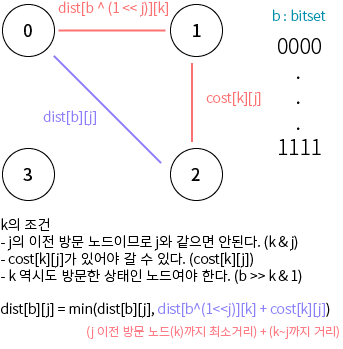

## 알고리즘 - 외판원 순회(TSP, bit + dp) :rainbow:

 1. N개의 노드(지점)을 출발점부터 시작하여 모든 지점을 한번씩 방문하고 돌아올 때 최소 거리를 구하는 문제

 2. 방문 하고 하지 않고를 bitmask로 나타낼 수 있다. (1 << n)

 3. dist[state][j] 개념을 알고 점화식을 세울 수 있는가?

    - dist[state][j] : 방문한 상태 = state, 마지막 방문 지점 = j 의 거리의 최솟값

    - dist[state][j] = dist[state-1][k] + cost[k][j]로 점화식 세울 수 있다.

    - 단, 그림과 같이 점화식을 세울때 k의 조건에 대해 명확히 정의해야 한다.
    
    - bitset for문 안에서 state 배열을 정의한 후 dp를 쓰는 참신한 문제

## 20. 07. 29 (수)

 - 복습 + 시뮬레이션 개인 문제도 밀어야한다. 나태해지지말자~ 
 
 - 물처럼 좋지도 싫지도 않은 하루의 연속이 되길
