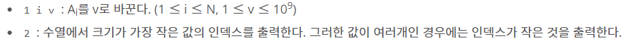

## 알고리즘 - A Journey To Greece(2) :airplane:

 1. 다익스트라 pq의 pair 순서를 명확히 해야 시간 차이가 나지 않는다.
    
    - pq의 pair값은 <cost, node>로 구성되야 한다. 그래야 최단 경로를 nlogn 만에 갱신 가능하며, <node, cost>로 구성할 경우 좀 더 많은 연산을 해야 한다!

 2. 연산자 우선순위

 ```
    A. dp[1<<(p+1)-1] 과 dp[(1<<(p+1))-1] 은 같은가?
     - No, 1 <<(p+1) - 1은 연산자 우선순위가 사칙연산이 먼저이므로 p=3일때 답은 2^3 = 8.

     - (1<<p+1))-1은 2^4 먼저 계산하므로 16 - 1 = 15.

    B. 연산자 우선순위는 사칙연산 → Shift 연산(<< , >>) → Bitwise 연산 순으로 진행된다.

 ```

 3. 잡지식 : #ifndef, #endif 구문의 사용 용도는?

  - 여러 파일에서 struct가 정의된 헤더파일을 끌어다 쓸 경우, 컴파일러 입장에서는 해당 struct가 중복 정의된다. 따라서, struct 정의 시에

```
#ifndef EDGE
struct EDGE{
    int s, t, prv;
}
#endif
```

 - 이와 같이 넣어준다면, **중복 정의되는 일이 사라질 것이다**.

## 알고리즘 - 트리의 독립집합 :evergreen_tree:

 

## 알고리즘 - 수열과 쿼리 15 :evergreen_tree:

 

 1. 수열을 받고 세그먼트 트리를 구성할 수 있는가?

```
   A. n개의 수열을 받고 2^n인 변수 만들기

    for(nn = 1; nn<n; nn*=2);

   B. 충분한 크기의 seg 배열 생성 후 nn+i-1 자리에 대입

    for(int i=1; i<=n; i++){
       seg[nn+i-1] = 수열 대입 (s[i]);
    }

   C. 1 ~ (depth-1) 까지 트리를 업데이트 할 수 있는가?

    for(int i=nn-1; i>0; i--){
       seg[i] = min(seg[i*2], seg[i*2+1]);
    }

   D. update query를 작성할 수 있는가?

    seg[nn+idx-1] = update 값
    
    for(int i=(nn+idx-1)/2; i>0; i/=2){
       seg[i] = min(seg[i*2], seg[i*2+1]);
    }

   E. 구간 쿼리를 날릴 수 있는가?

    int f(int left, int right, int L, int R, int node){
       if(R < left || L > left) return 1e9;
       if(L <= left && right <= R) return seg[node];
       int mid = (left + right) / 2;
       return min(f(left, mid, L, R, node*2), f(mid+1, right, L, R, node*2+1);
    }
```


## 20. 08. 04(화)
 - 모 코테에서 비슷하게 나온 유형인 dp_tree 유형 트리가 나오면 틀릴 일 없도록 노력하자!