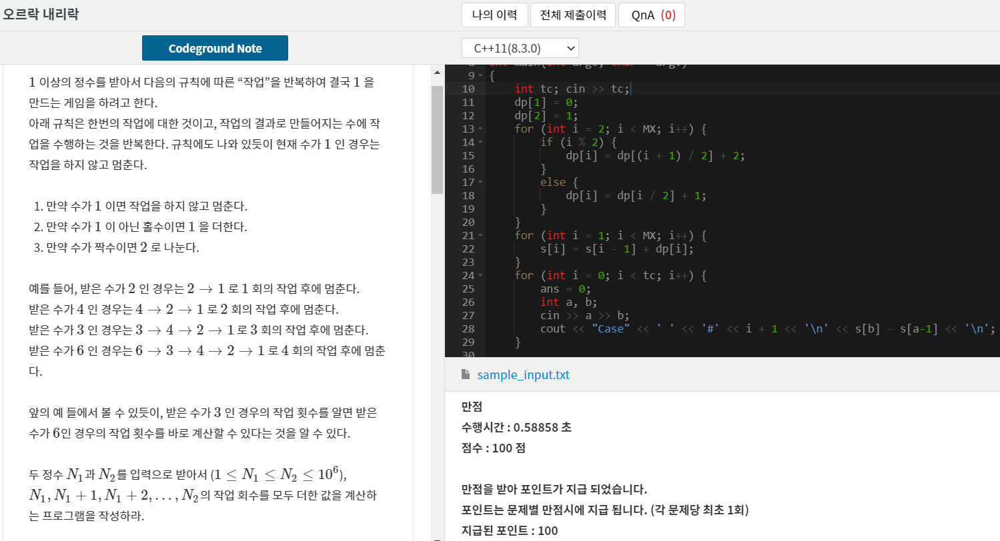

## 알고리즘 - 중앙값 :rainbow:

 - N-K+1개의 부분 수열의 중앙값을 출력하는 문제. But Query 개수가 5천

 - Naive하게 풀면 n이 250,000이라 무조건 TLE. 세그먼트 트리를 어떻게 녹여내는지 아는게 핵심 포인트

 1. K 시간 전 존재하는 수열값을 트리의 인덱스로 하는 세그먼트 트리를 구성할 수 있는가?

    - tree 값 업데이트는 필수, 인덱스 값은 1로, 인덱스의 합값을 저장한다.

 2. K 이후 값들로 들어오는 값들의 인덱스 값을 업데이트 한다. 이후, 쿼리를 통해 값을 뽑아낸다.

 CODE

 ```
 int n, k;
const int MX = 1e6;
int a[MX];
int seg[MX];
int nn = (1 << 17);

// 특정 구간에 대해 연산을 하는게 아니니까 필요없다.
// x : 현재 누적합이 몇 이상되어야 하는지
// lev : 현재 노드 번호

int f(int x, int lev) {
	// 리프노드라면 리프노드의 번호를 리턴
	if (lev >= nn) return lev - nn;
	// seg[lev*2] = 왼쪽 누적합이 x이상이라면
	// 왼쪽 재귀에서 반환한 값을 반환해라.
	if (seg[lev * 2] >= x) return f(x, lev * 2);
	// 왼쪽이 x보다 작다면
	// x를 x-seg[lev*2]로 바꿔주고, 오른쪽으로 간다.
	return f(x - seg[lev * 2], lev * 2 + 1);
}

int main() {
	ios_base::sync_with_stdio(0);
	cin.tie(0); cout.tie(0);
	cin >> n >> k;
	int i;
	for (i = 1; i <= n; i++) cin >> a[i];
	for (i = 1; i < k; i++) seg[nn + a[i]]++;
	// segtree 업데이트하는데 두 리프노드의 합을 업데이트
	for (i = nn - 1; i >= 1; i--) seg[i] = seg[i * 2] + seg[i * 2 + 1];

	long long s = 0;
	// 3초부터 10초까지
	for (i = k; i <= n; i++) {
		// update query
		for (int j = nn + a[i]; j >= 1; j /= 2) seg[j]++;
		s += f((k + 1) / 2, 1);
		for (int j = nn + a[i - k + 1]; j >= 1; j /= 2) seg[j]--;
	}
	cout << s;
	return 0;
}

```

## 알고리즘 - 오르락 내리락(SCPC #P1)

 - 문제에서 아~주 친절히 dp로 푸세요 하고 제시를 해줬다.
 
 1. 단, 여기서 dp 조건을 찾아내는게 Point

 2. 두 정수 N1, N2 까지의 작업 횟수의 합이므로, 이는 dp배열, psum 배열을 전처리 하여 만들면 O(1)에 처리할 수 있다. 시간복잡도는 O(n+tc)

  - prefix sum을 하지않으면 TLE 나는 흥미로운 문제.

 

## 20. 08. 05 (수)

 - 아무리 힘들어도 참아내자 n수 생활에 비해선 할만하다.