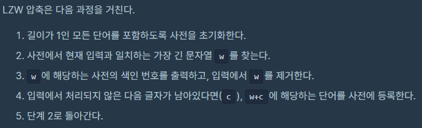
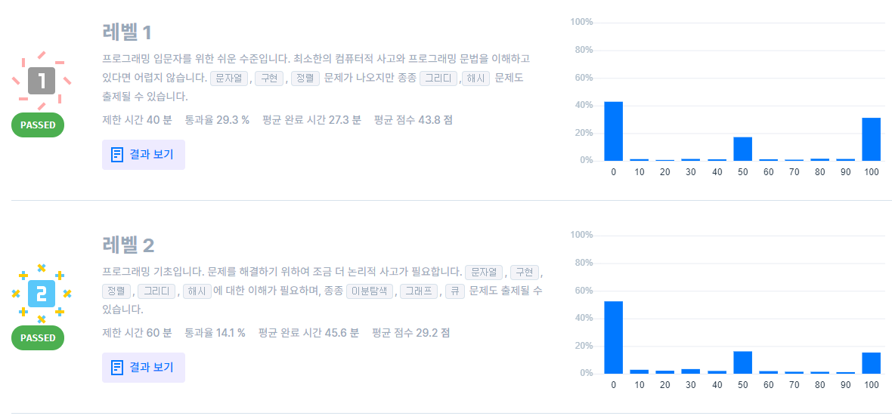

## 알고리즘 - 스킬 체크 1, 2 (프로그래머스)

 > 1단계

 1. 1부터 n까지 소수 몇개인가?

  - 에라토스테네스의 체를 구하면 nlog(logn)에 구할 수 있다.

```
    for(int i=2; i<=n; i++){
        if(che[i]) continue;
        prime_cnt++; << 반드시 여기에 카운팅 해야 한다는 점! ★
        for(int j=i; j<=n; j+=i){
            if(che[j]) continue;
            che[j] = 1;
        }
    }
```

 2. 임의의 숫자가 주어진 배열 중 가장 작은 수를 삭제한 배열을 반환해라.

  - 빠르게 하고 싶어서 소팅 후 lower_bound 했는데 안됬다. why?

  - **lower_bound는 반드시 소팅이 되야 할 수 있는 작업임을 잊지말자**

  - lower_bound를 소팅하지 않고 무심코 쓰는 버릇 있다. 조심하자

 > 2단계

 1. 주어진 요구사항을 그대로 구현할 줄 아는가?

   

  - string 벡터에 char값을 어떻게 넣을지 고민했었다.

    ```
    int → string : to_string()
    string → int : stoi()
    char → string : 그냥 string a = ""; a += s로 넣어라.!
    char b = 'A'이고, b+i를 하면 알아서 'B', 'C' 등등 된다.
    ```
  - 특히 이런 문제는 연습장에 써보고 옮기는 작업이 빨리 짜는데 도움된듯(nice)

 2. 임의의 숫자 배열이 주어질 때, 자기보다 작은 값이 나오기까지 시간 출력하기

  - lower_bound 냄새가 났지만 역시 정렬을 해야하는데 그렇지 못하므로 잘못 접근한 문제.

  - 그냥 naive하게 O(n^2)으로 풀 수 있었다. 쉬운 문제

   

  - 오예 둘다 100점!

## 알고리즘 - 코테 리뷰

 - 시험은 많이 쳐볼수록 공부가 되는 것 같다.

 1. 변형된 가지치기(dfs)를 제대로 구현하지 못해 시간 오래 끌었다. 
    - 보완해야 할 부분을 알려준 소중한 문제
    - 시험 끝나고 5분 뒤에 풀었다. 실수도 실력이라 아파하고 보완하자!

 2. 어제 본 Union-Find 문제가 오늘 나와서 아주 빠르게 풀 수 있었다.
    - 시험은 운인가? 어제 복습한 문제가 나오니 빨리 풀 수 있었다. 
    - But, 효율성 탈락. Why? 범위 체킹을 못한 잘못!
    - **edge 개수가 30만, cost가 10만이라면, 30만*10만 > int 범위 초과**
    - **답을 long long으로 했어야 하는데 int로 했다..**

 3. 애니팡 도움버튼 클릭 시 어디로 옮기세요 하는 기능 구현 문제.
    - 화면 크기가 10*10이라 naive하게 3중 for문으로 구현해도 되겠다 싶었다.
    - pivot 잡고 가로, 세로 따로 비교했고 swap을 자주 사용한듯.
```
    // while (board[a][b] == board[a][b + 1] && b + 1 < s) 하면 Runtime Error 나온다.

    // end 연산에서 앞 조건이 0이면 뒤는 체킹하지 않는 테크닉을 실제 활용하여 코드 간결화 + 속도향상 테크닉 실제 활용한 문제.

    while (b + 1 < s && board[a][b] == board[a][b + 1])
```

## 20. 08. 08(토)

 - 바빴지만 보람찬 하루. 계속 나아간다. 흐르는 물처럼
