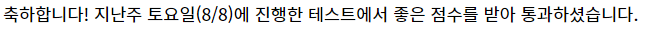

## 알고리즘 - 코드포스 리뷰(Round 663 - Div 2)

 #### A. Suborrays

  - 1 ~ n까지 수를 permutation 한 부분 수열 중, 어떤 i, j를 잡아도 (i <= j) OR operation (i ~ j) 한 수가 i ~ j의 길잇값보다 같거나 크다면 이는 good permutation이라 한다. 이런 경우의 수열을 찾아라는 문제이다.

  - 코드포스에서는 정답출력 시 하나의 띄어쓰기라도 틀리면 틀렸다고 판정하므로, 마지막 값을 출력할 때 형식에 주의하자.

  - 어떤 permutation 상태의 수열을 잡아도 Bitwise OR 하게 되면 증가하게 되므로, 결국은 단순한 permutation 수 아무거나 출력하면 되는 문제였다. 다 풀어놓고 출력 형식에 띄어쓰기때문에 자꾸 틀렸다고 나와 시간 까먹은 문제.

  - OR sum 배열을 만들고, prifix sum 형식으로 부분 OR sum의 합을 구하려 했지만 실패. s[i] - s[j-1]이거나, s[i] ^ s[j-1]은 원래 값을 보장해 주지 않는다.

 #### B. Fix You

  - 미로 탈출하기(https://www.acmicpc.net/problem/17090)와 비슷한 문제여서 끝점부터 반대로 bfs 할 때 진행 방향과 반대가 아닌 경우 답이지 않을까 생각했다. 하지만 Fail.

  - 이 문제는 (n,m) 점인 C의 세로방향, 가로방향의 값만 확인하면 되는 문제이다. Why?

  - 가로방향은 무조건 R이 되야 하고, 세로방향은 반드시 D가 되어야 한다. 왜 두 부분만 확인하면 되냐 하면

  - 이 문제는 **방향이 R과 D 두 방향밖에 없기 때문에 반드시 n,m의 가로, 세로 라인으로 다가오게 되어 있기 때문이다**

  - 만약 4방향이라면 이렇게 풀면 안되겠지. 미로 탈출하기 문제에서 역방향으로 푼 사람의 풀이법을 다시 보고 익히자.

##### ETC. What is volatile in C?

 - https://cafe.naver.com/lazydigital/26에 자세히 나와있지만, 생코에서 한번 다뤄졌던 이슈인 느낌이 들어 흥미로워 찾아본다.

 - volatile int i를 쓰면, 해당 변수에는 컴파일러의 Optimize 룰을 적용시키지 말라는 뜻이 된다.

 - int i; for(i=0; i<1000; i++); 와 같이 의미없는 반복문이 있다 하면 컴파일러는 필요없다 생각하여 Optimize 룰에서 이 구문을 빼버릴 수도 있다. 하지만, 사용자 입장에서 이 구문이 의도적으로 쓰여져야만 할 경우는 반드시 Optimize 룰 제거 키워드인 Volatile을 써야 하는 것이다.

 
## 20. 08. 10 (월)
 - 실제 Hardware를 만져보고 코드상에서 프로그래밍 하는 수업 굉장히 흥미롭다. 이 수업은 여얼심히 듣자

 - 어디라도 코테 합격은 기쁘다. 계속 달리자 모든 코테 뚫는 그날까지

 