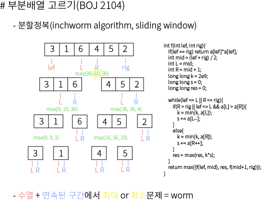

#### Etc. What is inline, register in C?

 - inline이란 함수 호출 시 사용하는 명령어이며, 보통 함수 실행 시 해당 함수의 주솟값을 찾아들어가서 실행하는 과정을 거친다. 하지만 재귀의 경우 이 작업에 오버헤드가 가해지며, 시간 단축을 위해 inline을 쓴다. 이걸 사용하면 해당 함수의 코드가 직접 호출자 함수 안으로 들어가게 되는 효과가 생기기 때문에 함수의 주솟값 찾는 작업을 줄일 수 있다. 하지만, 남발 시 코드가 길어지는 단점이 생길 수 있으니 적당한 길이의 함수에만 사용해야 효과를 기대할 수 있다.

 - register int a; 와 같이 사용하면 CPU에 있는 레지스터를 직접적으로 할당하기 때문에 좀 더 빠른 속력을 기대할 수 있다. 단, 레지스터는 많아봐야 10개정도이므로 배열같은데 쓸 수는 없다.

 ## 20. 08. 11(화)

  - 조지오웰 '1984' 여유 될때 읽어보자. 언젠가 도움이 될 수 있을 듯.