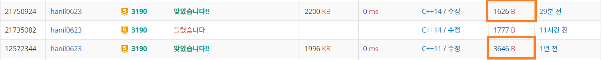

## 알고리즘 - 뱀(2)

 - 이 문제를 어떻게 연결리스트로 풀까?

```
  1. 빈칸일때

   - 뱀 길이가 전체적으로 움직이므로, 리스트의 첫칸을 삭제, 끝칸의 다음칸을 끝칸에 추가하는 연산 필요

   - 이때, 연결리스트의 첫칸(tail), 끝칸(head)을 변수로 관리할 줄 알아야 했다.

  2. 사과일때

   - tail은 그대로 둔 채 새로운 head 값만 리스트에 추가 후, 
   ★ 사과를 없애줘라 (map[nx][ny] = 0), 반례존재★

   - 어떤 Object를 없애는 작업에 민감해져라, 반드시 반례로 나온다. 명심명심
```

 - 백준 첫 문젤 풀때와 달라진 코드 길이

 - But, 시간복잡도가 최악 O(n^4)같은데, 연결리스트로 푼다고 해도 이득이 없는듯?

 

## 20. 08. 14 (금)

 - 연결리스트에 대한 감이 좀 생김. 똑같은 문제라도 방법이 다르면 어렵게 된다.

