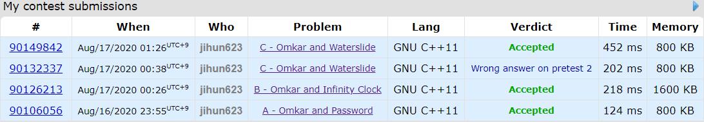
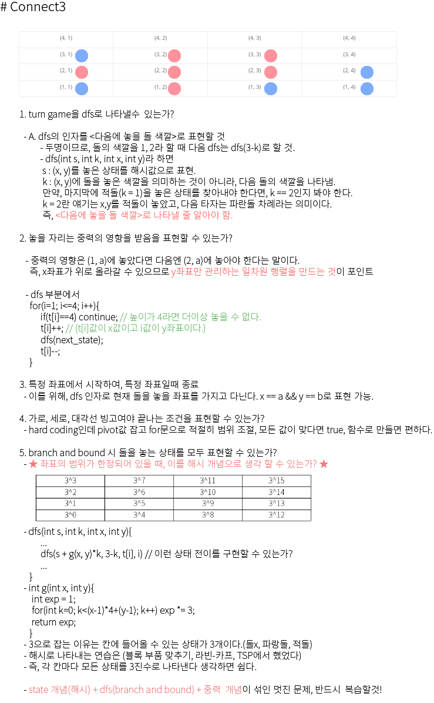

## 알고리즘 - Codeforce Global 10 리뷰

 #### Omkar and Password (A)

```
  상황 : 임의의 배열에서 인접한 두 원소를 빼내고, 그 합을 다시 집어넣는 연산이 있다고 하자.

        단, 인접한 두 원소가 같은 값이면 할 수 없다고 하면 더이상 원소의 길이를 줄일 수 없게 된다.

        Operation을 할 때, 최소로 줄일 수 있는 배열의 길이는?
```
```
  해결 : 초기 상태가 모두 같은 값을 가졌다면 더이상 줄일 수 없음이 확정이다.

        그럼, 연산을 하다가 같은 값이 나오는 경우가 나와 더이상 줄일 수 없는 경우가 있을까?

        답은 No이다. s[j] 상태가 같은 값만 존재하는 경우가 되려면 s[j-1]에서 같은 값이 나오도록 더하도록 강제되어야 한다. 하지만, 다른 경우로 더하면 다른 값이 되므로, 이런 경우는 존재하지 않음.

        그래서 답은 초기 같은 값이 있다면 같은 값의 길이를 출력하고, 아니라면 무조건 1이 된다.
```

  #### Omkar and Infinity Clock (B)

```
  상황 : 임의의 배열에서 최댓값 d를 뽑아낸 후, d - 각 원소 (a[i])를 한 값을 새로운 배열로 하자.

         임의의 배열이 주어지고, 위와 같은 연산의 횟수 k(1<=k<=10^18)이 주어질 때, 연산 후 배열 상태를 출력해라.
```
```
  해결 : 연산 횟수만큼 직접 해 보면 반드시 TLE가 나니까 규칙이 있을 것이라 생각했고, 직접 해보자.

         초기 배열 a와 한번의 연산후 배열 b를 구하고, k가 짝수면 b, 홀수면 a를 출력했다.
        단, k가 10^18이므로 long long을 사용해야 하는 센스
```

  #### Omkar and Waterslide (C)
```
  상황 : 임의의 배열이 주어지고, contiguous segment인 배열들을 1씩 증가할 수 있는 연산이 주어짐.

        이때, 모든 배열이 nondecreasing 상태(오름차순)이 되도록 하려면 연산을 몇번이나 해야할까?
```
```
  해결 : 간단하다. if(a[i] > a[i+1]) ans += a[i]-a[i+1] 끝.
         하지만 매우매우 실수하기 쉬운게 a[i]는 10^9까지이고 i는 200000 까지이다.
         그럼 최악의 경우, 10^9 * 200000 까지 ans가 갈 수 있고, 2*10^14이므로 int의 범위를 넘어설 수 있다. ans를 long long으로 해야 답이 됨을 캐치할 수 있어야 한다.
```

  




## 알고리즘 - 공교육 도박

 - 게임 규칙 문제인데 여기서 봐야할건 **주사위를 굴리는 행위, stop and go** 상황을 dp배열로 나타낼 수 있는가?

 - 주사위 + stop and go의 형태일 때 이런 식으로 dp를 쓸 수도 있구나 여기고 넘어가기

 ```
  dp[i][j][k] = i-1번째 주사위의 눈이 j고, i-2번째 눈이 k가 나왔고 i번째 턴을 던질 차례일 때, stop을 하거나 go를 하여 얻을 수 있는 최대 게임 룰의 점수이다.

  - (stop) : 만약, i번째 턴에서 던진 주사위의 눈이 만족스러운 경우, 그만 던지게 되므로 i, i-1, i-2의 주사위 눈 값을 통해 게임 룰을 적용하여 점수 산정을 할것이고

  - (go) : 만족스럽지 않다면 계속 주사위를 던질 것이다. 그럼 i+1번째 턴을 던질 차례일 때 얻을 수 있는 최대 점수가 나오겠지, 기댓값이므로 이를 다 sum 하여 계산한다.
```

```
  1. memoization을 사용하며 재귀를 돌리는 경우가 있다. 언제 사용해야 하냐면 내가 dp의 실행 순서를 제어할 수 없겠다 싶을 때는 재귀를 사용하고

  2. dp를 할 때 점화식을 세우고 for문을 돌리는 경우인데 실행 순서를 제어할 수 있겠다 싶으면 이렇게 가자. 하지만 보통 재귀를 사용하는게 더 편할듯.
```

 - Tip : 단순 게임 룰 계산은 함수를 이용하여 깔끔하게 계산하는 버릇 들이자.

 - 매우 큰 수인데 소숫점까지 요구한다면 long double 형 사용해 보자.

```
long double f(int i, int j, int k) {
    if (i > n)return 0;
    if (dp[i][j][k] > 0)return dp[i][j][k];
    long double s = 0;

    for (int l = 1; l <= 6; l++) {
        s += max(g(j, k, l), f(i + 1, k, l));
    }
    // 이처럼 dp배열에 값 넣는 센스 이렇게 활용하는게 좋은듯.
    return dp[i][j][k] = s / 6;
}
```

 
## 20. 08. 17(월)

 - turn game을 dfs or dp로 나타내는 로직이 굉장히 흥미로웠다.
 - long long 실수 항상 조심하자.
 - 공부하느라 망가진 피부관리 역시도 공부라 생각하고 하자.. T.T 내 자신은 내가 챙겨야..