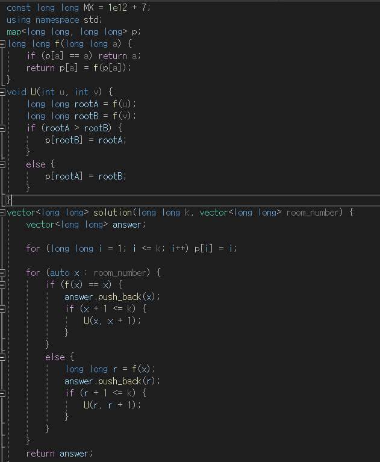
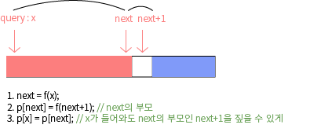

## 알고리즘 - 부분 문자열 뽑기(dp+game)

 - 턴제 게임에서 역시 dp[i] = i의 수를 가진 선공이 이길 수 있는가?

 :star:
```
 1. 진 부분 문자열을 뽑는 테크닉이 중요하다.

 int d[8] = {1, 10, 100, 1000, 10000, 100000, 1000000, 10000000};

 // 자리수 별로 나눠주는 for문, 이때 n과 같은 자리까지 나눠주는 조건이 중요
 for(int i=0; d[i] <= n; i++){
     // 모듈러 연산을 위한 for문
     for(int j=0; j<=7; j++){
         ★ 중요 ★
         int k(진 부분 문자열) = n / d[i] % d[j];
     }
 }

 2. 돌 게임과 달리 재귀로 썼는데, 상대 턴이 0이면 내가 이긴다는 논리를 재귀에 접목시킨 것.

 if(진부분문자열 != 0 && 원본문자 != 진부분문자 && f(n-k) == 0){
     답. n은 원본 문자, k는 진부분문자이다.
 }

 int f(int n){
     // memoization
     if(dp[n] != 1) return dp[n];
     for(int i=0; d[i] <= n; i++){
         for(int j=0; j<=7; j++){
             int k = n / d[i] % d[j];
             if(k != 0 && n != k && f(n-k) == 0){
                 return dp[n] = 1;
             }
         }
     }
    return dp[n] = 0;
 }
``` 
- 위 함수의 논리를 이해하는게 가장 중요함

## 알고리즘 - 호텔 방 배정(2)

 - 문제점

 

 - TLE가 난 이유는 k개의 원소(10^12)를 모두 할당해 주었기 때문에 터짐.

 - 해결

 

 - 위 그림과 같이 :star:**해당 쿼리의 개수만큼 map의 원소를 할당**:star:하는 것이 핵심.

 - f 함수에 구문 추가 : if(p[a] == 0) return a;

 - 이렇게 하면 TLE 해결 가능!

## 20. 08. 23 (일)
 - 스트레스 따위 즐겨 모르는걸 알게 되는게 더욱 중요하다.
 - 두통 따위