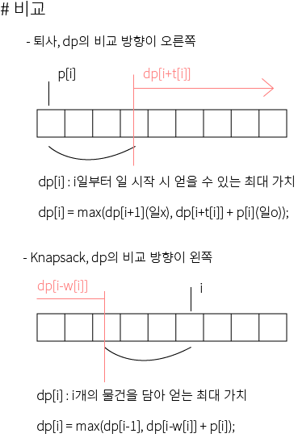

## 알고리즘 - 퇴사(dp)

 1. Knapsack이랑 방향이 반대인 문제이다. 굉장히 괜찮은 문제!

 

```
 - dp를 dfs로 나타내기
 
 int f(int pos){
     if(pos > n+1) return -987654321;
     if(pos == n+1) return 0;
     if(dp[pos]) return dp[pos];
     return dp[pos] = max(f(pos+1), f(pos + t[pos]) + p[pos]);
 }
```

```
 - for문으로 나타내기

 for(int i=n; i>=1; i--){
     if(i + t[i] <= n+1){
         dp[i] = max(dp[i+1], dp[i+t[i]] + p[i]);
     } else {
         dp[i] = dp[i+1];
     }
 }
```

## 알고리즘 - 동전 1

 - dp[i] : i원을 주어진 동전들을 이용해 만들 수 있는 가짓수

```
 1,2,5 = c[i]라 하면
 dp[i] = 1로 초기화하자. 왜냐면 i원을 모두 1원만 사용하여 만들 수 있으니까.

 for(int i=2; i<=n; i++)
    for(int j=1; j<=k; j++)
        dp[j] += dp[j-c[i]];
```

## 20. 08. 24(월)
 - 그냥 dp 문제 계속 연습해보자. 어렵다. 꾸준히~

 