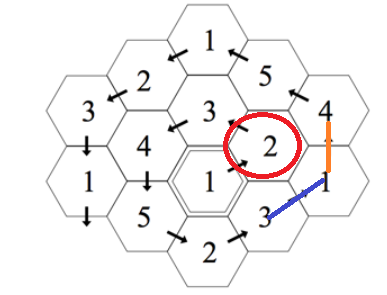

## 알고리즘 - 카탄의 개척자

 - 육각형 나선 구조를 어떻게 표현하는지 알 수 있는 아주 좋은 문제

 - 

```

1. 일단 시작점은 먼저 표기를 한다. a[x][y] = 1

2. 껍질별로 for문을 도는데 나선 바퀴 수 - 1만큼 위로 올라가는 작업이 있다.

3. 그리고 나서 바퀴 수 만큼 5방향 순회를 한다. 이때, x, y값은 바뀐 채로 유지를 해야 함. 절대 기준점이 아니다. 기준점이 돌아 갈때마다 바뀐다는 점 잊지말길

```

CODE

```
	for (i = 1; i <= 500; i++) {
		// 처음에는 오른쪽 위로 무조건 한칸 가야 한다.
		y = y + dy[0];
		x = x + dx[0];
		f(y, x);
		print();
		// 왼쪽 위로 가는 것을 i-1번 해야 한다.
		for (j = 1; j < i; j++) {
			y = y + dy[1];
			x = x + dx[1];
			f(y, x);
		}
		print();
		// 나머지 친구들은 반시계 방향으로 돌아가며 i번씩 한다.
		for (j = 1; j <= i; j++) {
			y = y + dy[2];
			x = x + dx[2];
			f(y, x);
		}
		print();
		for (j = 1; j <= i; j++) {
			y = y + dy[3];
			x = x + dx[3];
			f(y, x);
		}
		print();
		for (j = 1; j <= i; j++) {
			y = y + dy[4];
			x = x + dx[4];
			f(y, x);
		}
		print();
		for (j = 1; j <= i; j++) {
			y = y + dy[5];
			x = x + dx[5];
			f(y, x);
		}
		print();
		for (j = 1; j <= i; j++) {
			y = y + dy[0];
			x = x + dx[0];
			f(y, x);
		}
		print();
		if (cnt >= 10000) break;
	}
```

```
// xx, yy에 체킹하는 함수
void f(int yy, int xx) {
	int check[6] = { 0, };
    // 1. xx, yy 기준 6방향에 이미 기록되어 있다면 체킹한다.
	for (int j = 0; j < 6; j++) {
		int ty = yy + dy[j];
		int tx = xx + dx[j];
		check[a[tx][ty]] = 1;
	}
	// 2. 방향이 항상 새로 틀기때문에 check[j]엔 0이 걸릴 수 밖에 없다.
	vector<pair<int, int>> v;
	for (int j = 1; j <= 5; j++) {
		if (check[j] == 0)
			// b[j] : j가 쓰인 횟수
            // 즉 여기 반드시 하나 이상 온다는 점.
            // pq를 쓰는 것이 아니라 이렇게 벡터에 pair로 넣어 대신할 수 있는 점 반드시 알아둘것.
			v.push_back({ b[j], j });
	}
	sort(v.begin(), v.end());
	// 3. 같은 횟수면 가장 작은 번호로 맵에 기록한다.
	a[xx][yy] = v.begin()->second;
	// 적었으면 ++ 해주고
	b[v.begin()->second]++;
	// cnt는 현재 채우고 있는 친구가 몇번째인지.
	ans[++cnt] = v.begin()->second;
}
```

## 20. 09. 24(목)
 - 힘들어도 힘내자 할수있다!!
 - 육각 좌표 문제 두개 굉장히 괜찮은 문제이다. 자주 자주 풀어보길. 기출에 나올 수도 있다.

