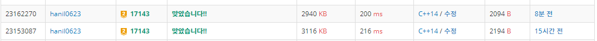

## 알고리즘 - 낚시왕(3.5)

 - 중첩 로직 체킹할 땐 반드시 맵 별로 순회해라.
 
```
		vector<pair<int, int>> tmap[105][105];
		int ssize = s.size() - 1;
		for (int k = 1; k <= ssize; k++) {
			int x = s[k].x;
			int y = s[k].y;
			int d = s[k].d;
			int siz = s[k].size;
			int spd = s[k].sp;

			if (s[k].id == -1) continue;
			map[x][y] = 0;

			if (d == 1 || d == 2) spd = spd % ((r - 1) * 2);
			else spd = spd % ((c - 1) * 2);
			
			int nx, ny, sx = x, sy = y;
			for (int kk = 0; kk < spd; kk++) {
				nx = sx + dx[d];
				ny = sy + dy[d];
				if (nx <= 0 || nx > r || ny <= 0 || ny > c) {
					if (d == 1) d = 2;
					else if (d == 2) d = 1;
					else if (d == 3) d = 4;
					else if (d == 4) d = 3;
					nx = sx + dx[d];
					ny = sy + dy[d];
				}
				sx = nx; sy = ny;
			}
			// 다음 갈 곳의 좌표 tmap에 일단 값을 넣음
			tmap[sx][sy].push_back({ s[k].size, k });
			s[k].x = sx; s[k].y = sy; s[k].d = d;
		}
		// 중첩 로직은 맵 전체를 순회하면서 (Obj 순회 X)
		for (int i = 1; i <= r; i++) {
			for (int j = 1; j <= c; j++) {
				if (tmap[i][j].size() > 1) {
					sort(tmap[i][j].begin(), tmap[i][j].end(), comp);
					int idx = tmap[i][j][0].second;
					// 경쟁에 밀린 상어는 죽음
					for (int k = 1; k < tmap[i][j].size(); k++) {
						s[tmap[i][j][k].second].id = -1;
					}
					// 반드시 클리어 후 map에 값 넣음(무결성 보장)
					tmap[i][j].clear();
					map[i][j] = idx;
				}
				// tmap은 1이상, 1, 0이 있을 수 있다. 항상 인지해라.
				else if(tmap[i][j].size() == 1){
					map[i][j] = tmap[i][j][0].second;
				}
			}
		}
	}
	cout << ans << '\n';
```

 - 속도도 미세하게 더 빠르고 이 방법 쓰자!
 
 

 ## 알고리즘 - Gaaaaaaaaaarden (3)

  - 중첩 이슈에서 무결성을 보장하는 코딩을 하기 위해 어떤식으로 할까?

  - [원자 소멸 시뮬레이션]의 경우, **1초에 1씩 움직이는 조건**이 있었고

  - 임시 맵을 활용하지 않고 :star:**map[x][y] >= 2 → x, y에 맞는 Obj for문 매칭**:star:하여(보통 Obj → x, y인데 여기선 거꾸로 함, 맵이 클 경우 저렇게 하자) 문제 해결을 했었다.

  - 이 문제도 1초에 퍼지는 조건이 있다면, pair<시간, 컬러> tmap[x][y]를 선언하고 if(color != ncolor && ntime == time + 1) { 꽃을 피움() [중첩 이슈 처리] }을 생각할 줄 아는 로직이 매우매우 중요하다. 

  - 이런 시간 이슈가 있을 때 어떻게 활용할 수 있을것인가? 반드시 인지할 것

## 알고리즘 - 스티커 붙이기(4)

 - k 개의 스티커가 있고 스티커를 붙일 수 있다면 2번 스티커를 입력받아 붙일 수 있는지 아니라면 회전하고 붙일 수 있는지 확인하는 로직의 틀을 구현.

 ```
    while (k--) {
		cin >> x >> y;
		for (int i = 0; i < x; i++) {
			for (int j = 0; j < y; j++) {
				cin >> stick[i][j];
			}
		}
		bool flag = false;
		for (int g = 0; g < 4; g++) {
			flag = isstick();
			if (flag) break;
			else {
				rotate(); swap(x, y);
			}
		}
	}
```

 - isstick() 함수의 구현법 다시 한번 정리

 1. 핀셋좌표 설정(px, py의 범위를 잘 생각할것, 단 (0,0)과 (1,1)은 다르다)

 2. 안에서 스티커 좌표를 돌며 체킹

 3. 이때, 노트도 1이고 스티커도 1이여야 붙일 수 없는 상태임.

 4. 붙일 수 있다면 붙이는데 이때도 노트는 0이고 스티커는 1이여야 붙일 수 있는 상태임 아니라면 덮어쓰기 되버리니까 조심해라.

 5. 좌표 역시 note[px+i][py+j] 이고, 스티커는 stick[i][j]임을 명심해라.

 #### 도형 돌리기 방법 format화

 - 도형은 돌릴때마다 x, y 크기가 달라진다. ({x : 5, y : 2}라면 돌리면 {x:2, y:5}가 된다.

 - temp[i][j] = stick[x-j-1][i]

 - 모든 좌표 돌릴때마다 x,y의 범위가 바뀐다는점 조심하고, Full Code

```
void rotate() {
	int temp[15][15];
	for (int i = 0; i < y; i++) {
		for (int j = 0; j < x; j++) {
			temp[i][j] = stick[x - j - 1][i];
		}
	}
	memset(stick, 0, sizeof(stick));
	for (int i = 0; i < y; i++) {
		for (int j = 0; j < x; j++) {
			stick[i][j] = temp[i][j];
		}
	}
}
```

## 20. 10. 11(일)

 - 무조건 기출 다 돌린다. 다 풀자. 할 수 있다.
 


