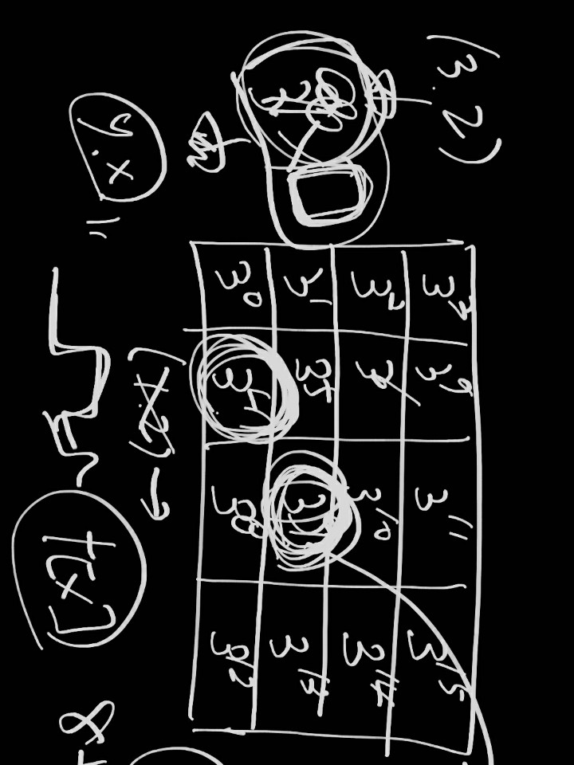

## 알고리즘 - Connect 3 (2)

 

 - 1. 위와 같이 i, j를 넣으면 해시값이 나오는 원리의 g함수 작성법

 ```
 int g(int u, int v) {
	int ret = 1;
	for (int i = 1; i <= (u - 1) * 4 + v - 1; i++) {
		ret *= 3;
	}
	return ret;
}
```

 - 2. 흑돌 백돌인 경우 인자값은 (다음 차례 돌)로 넣는게 일반적이다.

 - 돌을 확실히 c배열에 넣기 전까지 k는 돌을 놓은게 아니다. 그러므로 흑돌인 k = 1부터 백돌이 마지막으로 놓았는지 판단하는 여부는 함수 k 가 2일때이다. (다음 차례인 k가 2라면 백돌이 놓을 차례이다, 즉, k == 1이여야만 흑돌이 다음에 놓을 차례이고 그 말은 최종적으로 백돌이 마지막으로 놓았단 얘기이다.)

 ```
 void f(int s, int k, int x, int y) {
	if (check[{ s, { x, y } }]) return;
	check[{s, { x, y }}] = 1;

	if (isok()) {
		// 오목이라면.
		if (x == a && y == b && k == 1) res++;
		return;
	}
	
	for (int i = 1; i <= 4; i++) {
		if (t[i] > 3) continue;
		// 아 t[i]값을 올려놓고 맵에 추가해야지....
		// c[i] 여부는 체킹 안해도 되는군.
		t[i]++;
		c[t[i]][i] = k;
		f(s + g(t[i], i) * k, 3 - k, t[i], i);
		// 맞네 prev 과정도 반대로 되면 안된다.
		// 기존값 0으로 만들고 나서 값을 빼야지 와ㅏㅏㅏㅏㅏㅏㅏ
		c[t[i]][i] = 0;
		t[i]--;
	}
}

int main() {
	
	cin >> x >> a >> b;
	t[x]++;
	c[1][x] = 1;
	// 1은 흑돌
	// 턴제는 말이야. 다음에 돌을 놓을 사람.
	f(g(1, x), 2, 1, x);
	cout << res;
	return 0;
}
```

## 20. 10. 16(금)

 - 계속 해라 뭘 고민하나.. 맛있는거 먹고 스트레스 풀고 달려야지 모
 
