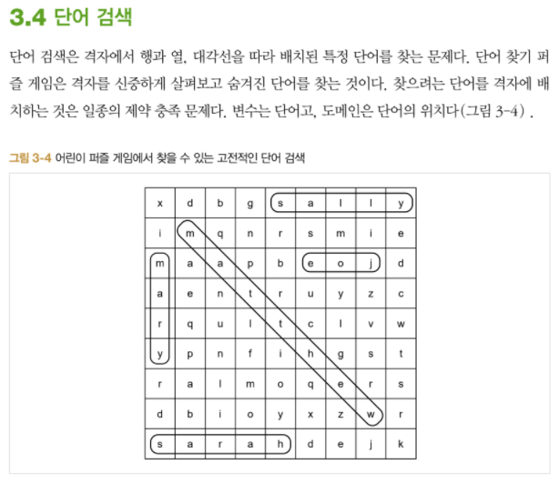

## 알고리즘 - C++ 문자열 파싱

- https://newdeal123.tistory.com/34 참조

```
string s; // s = 123,52,6,321 같은 경우
vector<int> v;
getline(cin, s);
int idx = 0;
for(int i=0; i < s.size(); i++){
    if(s[i] == ' '){
        v.push_back(stoi(s.substr(idx, i-idx)));
        idx=i+1;
    }
}
v.push_back(stoi(s.substr(idx)));
```

## 알고리즘 - Python 문자열 파싱

- s = "{{4,2,3}, {3}, {2,3,4,1}, {2,3}}" 어떻게 파싱할래?

```
s = s[2:-2].split("}, {") 하면 끝난다. 미친 파이썬..
```

- Custom Sorting in Python
- https://blackinkgj.github.io/python-custom-comparator/ 참조
- sample = [[4,'c'], [10, 'b'], [13, 'b'], [1, 'd'], [10, 'a']]

```
from functools import cmp_to_key

def compare(x, y):
    // C++의 부등호와 반대이다. < 기호를 쓰면 여기서는 큰 순서로 소팅
    if(x[0] < y[0]):
        return 1
    elif(x[0] > y[0]):
        return -1
    else:
        if(x[1] < y[1]):
            return -1
        elif(x[1] > y[1]):
            return 1
        else:
            return 0

print(sorted(sample, key=cmp_to_key(compare)))

sample = [[13, 'b'], [10, 'a'], [10, 'b'], [4, 'c'], [1, 'd']]

```

## 알고리즘 - 단어 검색 게임




- 검색 시 방향 왼->오, 대각선 오른쪽 아래, 위->아래, 대각선 왼쪽 아래 로 검색더라

## 알고리즘 - 리틀 프렌즈 사천성

:star: 
첫번째 for문을 끝까지(while) 나아가면서 그 안에 또다시 for{ while()} 구조로
나아가는 로직이 중요. 이때 들어오는 방향은 반드시 첫번째 for 방향과 직각 방향만 처리해야 함.

참조 : https://coding-insider.tistory.com/entry/%ED%94%84%EB%A1%9C%EA%B7%B8%EB%9E%98%EB%A8%B8%EC%8A%A4-3-%EB%A6%AC%ED%8B%80-%ED%94%84%EB%A0%8C%EC%A6%88-%EC%82%AC%EC%B2%9C%EC%84%B1-CC-%E2%98%85%E2%98%85

```
bool solve(int x, int y)
{
    for (int i = 0; i < 4; i++) {
        int nx = x + dx[i];
        int ny = y + dy[i];
        char find = Map[x][y];
        while (safe(nx, ny) && (Map[nx][ny] == '.' || Map[nx][ny] == find)) {
            if (Map[nx][ny] == find) {
                Map[nx][ny] = '.';
                Map[x][y] = '.';
                return true;
            }

            for (int j = 0; j < 4; j++) {

                // 방향 설정이 중요해
                if ((i == j) || (i == 0 && j == 1) || (i == 1 && j == 0) || (i == 2 && j == 3) || (i == 3 && j == 2)) continue;
                // 직각 방향의 i, j 관계만 여기에 들어올 것

                int nnx = nx + dx[j];
                int nny = ny + dy[j];
                while (safe(nnx, nny) && (Map[nnx][nny] == '.' || Map[nnx][nny] == find)) {
                    if (Map[nnx][nny] == find) {
                        Map[nnx][nny] = '.';
                        Map[x][y] = '.';
                        return true;
                    }
                    nnx += dx[j];
                    nny += dy[j];
                }
            }
            nx += dx[i];
            ny += dy[i];
        }
    }
    return false;
}
```
## 알고리즘 - 색상환 (Python)

 - dp[n][n] 배열 초기화 한번에 하기
 - dp = [[0 for i in range(n+1)] for j in range(n+1)]

```
	for (int i = 0; i <= n; i++) {
		dp[i][1] = i;
		dp[i][0] = 1;
	}

	for (int i = 4; i <= n; i++) {
		for (int j = 2; j <= k; j++) {
			dp[i][j] = (dp[i - 2][j - 1] + dp[i - 1][j]) % MOD;
		}
	}
```


## 21. 01. 05(화)

 - Remind


