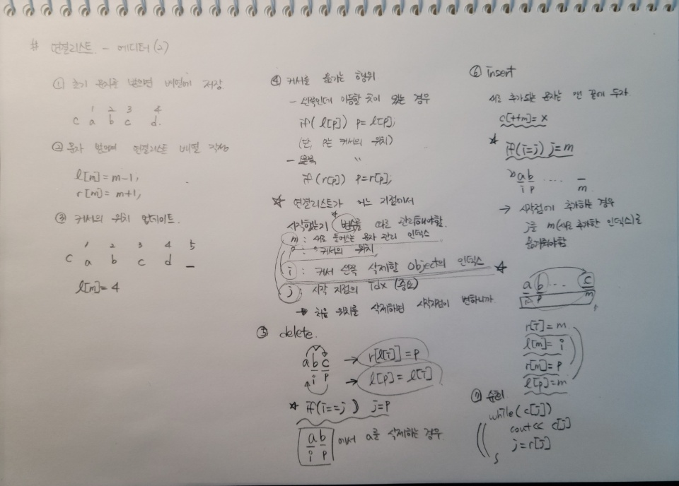

## 알고리즘 - 에디터 (3)

 

 - 연결리스트 CRD, 변수 설정이 굉장히 중요했던 문제

## 알고리즘 - 호텔 방 배정(4)

 - 연결리스트라고 생각했으나, k가 10^12 이므로 연결리스트 설정 못함

 - Union-Find가 정해인데, 기존의 p배열 설정을 하지 못하므로, Map으로 대신 했다.

 - 참조 : https://taxijjang.tistory.com/54

```
map<ll, ll> parrent;
ll _find(ll a) {
    // 기존의 getParent 함수와 틀린건 부모 설정을 이때 해준다는점.
	if (parrent[a] == 0)
		return a;
	if (parrent[a] != a) {
		return parrent[a] = _find(parrent[a]);
	}

	return parrent[a];
}

vector<long long> solution(long long k, vector<long long> room_number) {
	vector<long long> answer;

	for (ll room : room_number) {
		ll next = _find(room);
		answer.push_back(next);
		parrent[next] = _find(next + 1);
		parrent[room] = parrent[next];

	}
	return answer;
}
```

## 알고리즘 - 스도쿠


```
row[i][j] : i번째 행에 j의 숫자가 있는지 체킹
col[i][j] : i번째 열에 j의 숫자가 있는지 체킹
sqr[i][j] : i번째 스퀘어(3x3)에 j의 숫자가 있는지 체킹

- 9x9의 큰 정삼각형을 3x3 구역으로 나누는 방법 : (i / 3) * 3 + (j / 3) [i,j는 좌표]

- cnt(depth)로 x, y 좌표를 알아내기 : x = (cnt / 9), y = (cnt % 9)

void f(int cnt) {
	int x = cnt / 9;
	int y = cnt % 9;

	if (cnt == 81) {
		for (int i = 0; i < 9; i++) {
			for (int j = 0; j < 9; j++) {
				cout << map[i][j] << ' ';
			}
			cout << '\n';
		}
		exit(0);
	}

	if (map[x][y] == 0) {
		for (int i = 1; i <= 9; i++) {
            // 행도 없고 열도 없고 정사각형에도 없는 수라면 넣고 다음 상태로
			if (row[x][i] == 0 && col[y][i] == 0 && square[(x / 3) * 3 + (y / 3)][i] == 0) {
				row[x][i] = 1;
				col[y][i] = 1;
				square[(x / 3) * 3 + (y / 3)][i] = 1;
				map[x][y] = i;
				f(cnt + 1);
				map[x][y] = 0;
				row[x][i] = 0;
				col[y][i] = 0;
				square[(x / 3) * 3 + (y / 3)][i] = 0;
			}
		}
	}
	else {
		f(cnt + 1);
	}
}
```


## 알고리즘 - 할인 조건

 - 모아서 구매한 금액이 50원을 넘으면 10원을 깎아준다고 할 때, n개의 물품 중 어떻게 모아서 구매를 해야 최대 할인 금액을 받고 구매할 수 있을까?

 - 1. 자체 금액이 50원을 넘으면 바로 답에 더해준다.

 - 2. 그렇지 않으면 multiset에 해당 금액을 넣는다.

 - 
```
 - 이런 스위핑 + 자료구조 적 알고리즘이 굉장히 어렵다..

	while (ms.size() >= 2) {
		// 가장 큰값과 작은 값을 합칠때 50이 넘는다
		if (*ms.begin() + *ms.rbegin() >= 50) {
			ans += (*ms.begin() + *ms.rbegin() - 10);
			ms.erase(ms.begin());
			ms.erase(ms.find(*ms.rbegin()));
		}
		else {
            // 그렇지 않으면 두 값을 더해 set에 넣고 기존 두 값은 삭제
			int f1 = *ms.begin();
			ms.erase(ms.begin());
			int f2 = *ms.begin();
			ms.erase(ms.begin());
			ms.insert(f1 + f2);
		}
	}
```

## 알고리즘 - 단체 사진 찍기

 - n개의 쿼리문에 모두 만족하는 사진 순서가 몇개나 있는지 찾아내기

 - 특정 상태를 next_permutation으로 표현할 수도 있었다는 사고의 유연함 찾아내기

```
int solution(int n, vector<string> data) {
	int ans = 0;
	while (1) {
		bool isok = true;
		for (int i = 0; i < data.size(); i++) {
			int pos1 = getPos(data[i][0]);
			int pos2 = getPos(data[i][2]);
			char condition = data[i][3];
			int pos3 = data[i][4] - '0';
			if (!isok) continue;
			if (condition == '=') {
				if (!((abs(pos1 - pos2)-1) == pos3)) {
					isok = false;
					continue;
				}
			}
			else if (condition == '>') {
				if (!((abs(pos1 - pos2)-1) > pos3)) {
					isok = false;
					continue;
				}
			}
			else {
				if (!((abs(pos1 - pos2)-1) < pos3)) {
					isok = false;
					continue;
				}
			}
		}
		if (isok) {
			ans++;
		}
		if (!next_permutation(sol, sol + 8)) break;
	}
	return ans;
}
```

## 21. 01. 15(금)

 - 나태지옥 벗어나기

 - 그리디 연습