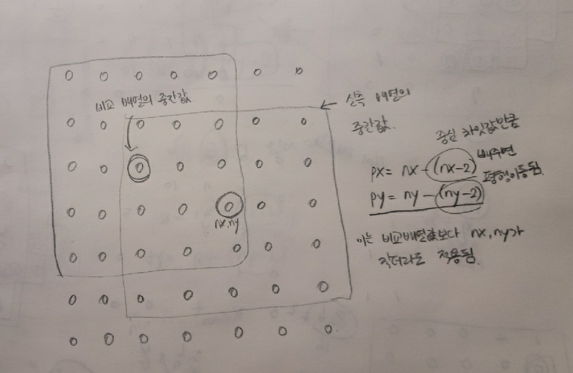
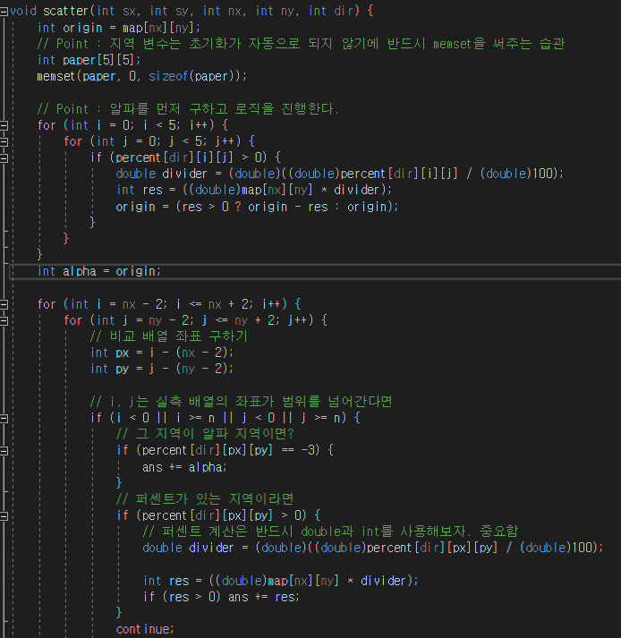
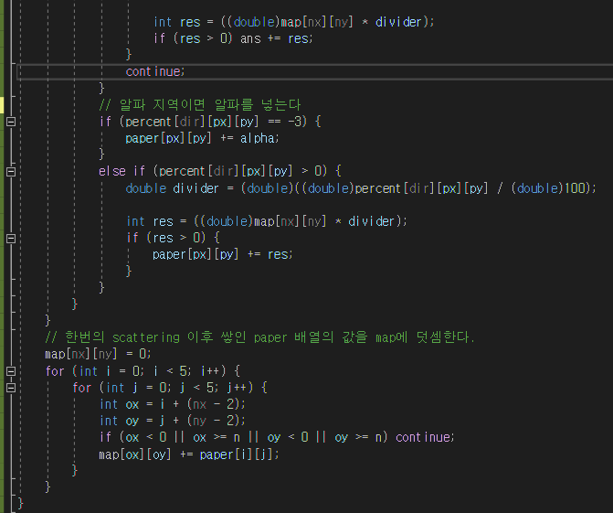

## 알고리즘 - 마법사 상어와 토네이도

 :one: 토네이도형 움직임을 구현할 수 있는가?

  - 카탄의 개척자 로직과 비슷하게 구현. 각 방향별로 두번씩 돌아간 후 증가.

```
    while(isok){
        // 화살표를 한칸씩으로 줄여보면 좌, 하, 우, 상 한번씩 돌아가므로
        for(int k = 0; k < 4; k++){
            // 각 방향 별 몇번 움직여야 하는지
            for(i < dicnt){
                nx = x + dx[k]; ny = y + dy[k];
                if(범위 체킹) break;
                scatter(x, y, nx, ny, 0);
                x = nx; y = ny;
            }
            // 움직이는 변수를 둔다. 1 -> 0으로 가는 순간 두번 움직였으므로
            // 다음 이동할 dicnt를 증가시킨다.
            mod = (mod+1) % 2;
            dicnt = (mod == 0 ? dicnt + 1 : dicnt);
        }
    }
```

 :two: 실제 비교할 배열의 범위와 실측좌표의 범위를 일치시킬 수 있는가? ★

```
 비교할 배열의 범위는 [0 ~ 4][0 ~ 4]인데 실측좌표는 nx, ny이다.(중심 기준)

- 즉, 실측좌표는 [nx - 2 ~ nx + 2][ny - 2 ~ ny + 2]까지 비교하고

  저 범위를 0 ~ 4로 넣어줘야한다.
```
 - 

 - 
 
 - 

## 알고리즘 - 마법사 상어와 파이어스톰

 - 함수 안에 선언된 지역변수 배열을 초기화하지 않으면 틀린다.

 - 특정 범위 간 배열 돌리기가 핵심.

```
void rotating(int sx, int sy, int ex, int ey) {

	// 스타트 지점이 다른 경우 0으로 가져와서 넣어야 돌려지는 교훈 문제
	int temp[70][70];
	int temp2[70][70];
	// 기존 맵의 값들을 0,0부터 n,n까지의 temp 배열로 세팅
	for (int i = 0; i < ex - sx; i++) {
		for (int j = 0; j < ey - sy; j++) {
			temp[i][j] = map[sx + i][sy + j];
		}
	}
	// 내가 아는 기존의 배열 돌리기 => temp2에 저장
	int g = ex - sx;
	// 배열 돌릴때 y와 x의 범위가 바뀐다.
	for (int i = 0; i < ey - sy; i++) {
		for (int j = 0; j < ex - sx; j++) {
			temp2[i][j] = temp[g - j - 1][i];
		}
	}

	// 돌린 temp2 배열을 기존 map[i][j]에 저장
	for (int i = sx; i < ex; i++) {
		for (int j = sy; j < ey; j++) {
			map[i][j] = temp2[i - sx][j - sy];
		}
	}
}
```

 - 2^n은 비트마스킹으로 n = (1 << n); 으로 쉽게 나타낼 수 있었다.
 

## 21. 01. 18(월)

 - 구현, 시뮬이 느리고 특히 배열 평행이동 부분이 매우매우 약함. 될때까지 ㄱ


