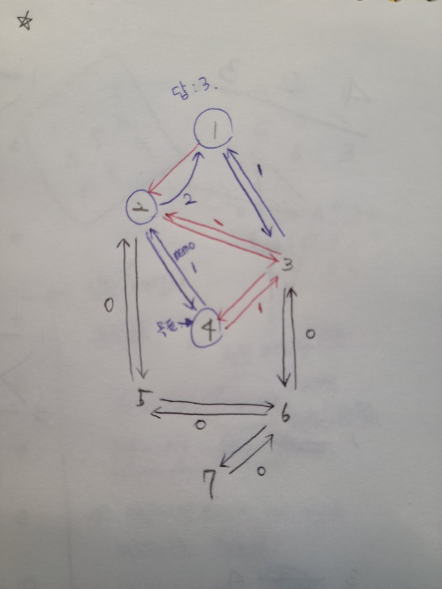
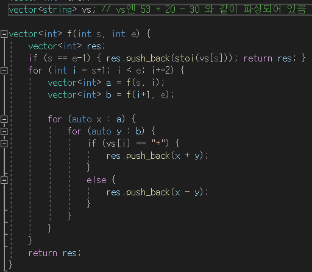

## 알고리즘 - Spot 간 경로의 수 찾기 비교 (vs 내리막길)

- dfs 상에서 경로의 수를 찾는 로직은 목적지에 도달하면 1 아니면 0으로 구성.

- 전체적인 로직은 정해진 틀이 있다.

- 다음 노드로 이동할 조건만 바꿔주고 나머진 똑같이 가자

- 경로의 수 찾기

```
// 시작점에서 출발하여 중간지점 거치고 목표 지점에 도달하는 경우의 수
int myf(int x) {
	if (aa[x] != -1) return aa[x];
	int res = 0;
	if (x == hub) return aa[x] = 1;
	for (int ch : graph[x]) {
		res += myf(ch);
	}
	return aa[x] = res;
}

int myg(int x) {
	if (bb[x] != -1) return bb[x];
	int res = 0;
	if (x == dest) return bb[x] = 1;
	for (int ch : graph[x]) {
		res += myg(ch);
	}
	return bb[x] = res;
}

cout << (myf(srt) % MOD * myg(mid) % MOD) % MOD << '\n';
```

- 내리막길 코드

```
int f(int x, int y) {
	if (x == n - 1 && y == m - 1) {
		return 1;
	}
	int& ret = dp[x][y];

	if (ret != -1) return ret;
	for (int i = 0; i < 4; i++) {
		int nx = x + dx[i];
		int ny = y + dy[i];
		if (nx < 0 || nx >= n || ny < 0 || ny >= m) continue;
		if (map[nx][ny] < map[x][y]) {
			dp[x][y] += f(nx, ny);
		}
	}
	return dp[x][y];
}
```

 - 직접 해보면 답이 나온다.
 

## 알고리즘 - 수강신청

  - 반례는 어디서 어떻게 만들어지는가? 에 대한 훈련을 하기 좋았던 문제

  - 수강 가능 인원(k)와 수강신청 로그 길이(L) 간에 조건 비교를 꼭 해봐라

  - if(k > L) 이라면? (k < L) 이라는 조건이 있는가?

  - 여러번 수강신청 할 경우, 제일 마지막으로 신청한 기록만 남고 먼저 신청한 기록은 없어진다. 그럼 끝에서 부터 한번만 읽으면 된다.

## 알고리즘 - 잃어버린 괄호

 - 완탐으로 풀다 TLE 받았지만 충분히 응용 가능한 코드

 

 - 그리디로 첫번째 마이너스가 나오면 뒷 부분은 모두 마이너스로 풀리게 하면 최솟값

 - 스위핑 느낌으로 부호가 나오기 전까지 임시 변수 tmp를 계속 추가하고 부호가 나오면 더해주는 이런 느낌을 잘 기억해야했음


 - 블로그 참고 : https://jaimemin.tistory.com/504

```
int minResult(void)
{
    int result = 0;
    string temp = "";
    bool minus = false;

    for (int i = 0; i <= str.size(); i++)
    {
        //연산자일 경우
        if (str[i] == '+' || str[i] == '-' || str[i] == '\0')
        {
            // 마이너스 나올 당시엔 빼주는게 아니고 표시만 하는거임. 다음 턴부터 빼주는것이다.
            if (minus)
                result -= stoi(temp);
            else
                result += stoi(temp);
            temp = ""; //초기화
            //괄호를 뺄셈 이후에 치면 최소

            if (str[i] == '-')
                minus = true;
            continue;
        }
        //피연산자일 경우
        temp += str[i];
    }
    return result;
}
```

## 알고리즘 - 가르침(완탐)

 - 비트마스킹 풀이법으로 20ms 만에 들어온 것도 있는데 나중에 찾아볼 것.

 - 이것도 조심해야 할게 단어를 보고 새로 익힌 slist의 size(익힌 단어 수)와 가르쳐 줄 단어의 수가 더 크다면? 이러면 종료조건으로 들어올 수 있으므로 반례.

 - 재귀함수의 종료조건 cnt는 최대 min(가르쳐 줄 단어 수, 익힌 단어)여야 하는 문제

```
void f(int idx, int cnt) {
	int ssize = slist.size();
	if (cnt >= min(k - 5, ssize)) {
		set<char> schema;
		int res = 0;
		schema.insert('a');
		schema.insert('n');
		schema.insert('t');
		schema.insert('i');
		schema.insert('c');
		
		for (int i = 0; i < 27; i++) {
			if (checklist[i]) {
				schema.insert(i + 'a');
			}
		}

		for (int i = 0; i < qlist.size(); i++) {
			bool isok = true;
			for (int j = 0; j < qlist[i].size(); j++) {
				char _word = qlist[i][j];
				if (schema.find(_word) == schema.end()) {
					isok = false;
					break;
				}
			}
			if (isok) {
				res++;
			}
		}
		ans = max(ans, res);
		return;
	}

	for (int i = idx; i < slist.size(); i++) {
		int wordidx = slist[i] - 'a';
		if (checklist[wordidx]) continue;
		checklist[wordidx] = 1;
		f(i, cnt + 1);
		checklist[wordidx] = 0;
	}
}
```

## 21. 01. 20(수)

 - [분류] 그리디 알고리즘 풀어야함 약하다

