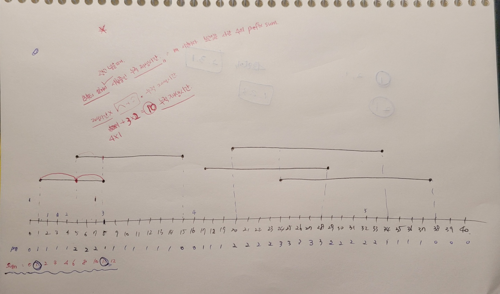

## 알고리즘 - 광고 삽입(prefix sum)

 - 시, 분, 초를 모두 초단위로 바꿔 생각할 수 있는가?

 1. 로그의 시작점과 끝점을 arr[시작]++, arr[끝점]-- 을 할 수 있는가?

 2. 이후, 이 배열 arr을 prefix sum을 한 결과가 의미하는 바를 알 수 있는가?

  - pre[i] : i초에 광고 시청 중인 사람의 수

 3. 누적 광고 시청 시각을 pre[i]의 prefix sum과 같음을 이해할 수 있는가?

 

 - 구간 처리를 prefix sum으로도 생각할 수 있다는 힘을 길러준 문제.

```
string solution(string playtime, string adv_time, vector<string> logs) {
    int n = str2int(playtime), m = str2int(adv_time);
    for (string watch : logs) {
        int stt = str2int(watch.substr(0, 8));
        int end = str2int(watch.substr(9, 8));
        arr[stt]++; arr[end]--;
    }
    cout << "ary is : " << '\n';
    for (int i = 0; i <= 40; i++) {
        cout << arr[i] << ' ';
    }
    cout << '\n';
    // 각 시각에 몇명의 사람들이 보고 있냐?
    for (int i = 0; i <= n; i++) {
        if (i == 0) pre[i] = arr[i];
        else pre[i] = pre[i - 1] + arr[i];
    }
    cout << "pre is : " << '\n';
    for (int i = 0; i <= 40; i++) {
        cout << pre[i] << ' ';
    }
    cout << '\n';
    // 해당 시각 까지 보고 있는 시청자의 수
    for (int i = 0; i <= n; i++) {
        if (i == 0) tot[i] = pre[i];
        else tot[i] = tot[i - 1] + pre[i];
    }
    cout << "tot is : " << '\n';
    for (int i = 0; i <= 40; i++) {
        cout << tot[i] << ' ';
    }
    cout << '\n';
    ll res = 0, mxt = tot[m - 1];
    // [i, i+m-1]까지 구간동안 시청자의 누적합을 구해주는 문제.
    for (int i = 1; i <= n - m; i++) {
        if (mxt < (tot[i + m - 1] - tot[i - 1])) {
            mxt = (tot[i + m - 1] - tot[i - 1]);
            res = i;
        }
    }
    return int2str(res);
}
```

## 알고리즘 - 사장님 달려가고 있습니다(bfs)

 - check 배열을 구분할 수 있는 하나의 상태로 만들어준다는 사실이 중요하다.

 - 즉, check배열의 각 원소값은 유일한 상태를 유지해야 하도록 한다.

 - check[i][j][k][l] : i,j의 위치까지 k의 이동거리로 오며, 이때 방향이 l인 상태.

 - 상탯값이 많아도 1,1에서 2,1로 갔다가 다시 1,1로 돌아오는 경우의 수가 있을 수 있다. 하지만 최소거리란 조건에서 이 값은 갈 수는 있으나 답으로 채택될 순 없기에 안심해도 된다.

 - 단, 처음 진입 시 큐에 여러개의 상태를 모두 고려하여 대입해야 하는 케이스 조심해라.

```
#include<iostream>
#include<queue>
using namespace std;
int n;
int map[105][105];
int check[105][105][105][4];

struct info {
	int x, y, k, d, t;
};
queue<info> q;
int dx[4] = { -1, 0, 1, 0 };
int dy[4] = { 0, 1, 0, -1 };

int main() {
	ios_base::sync_with_stdio(0); cin.tie(0);
	cin >> n;
	for (int i = 1; i <= n; i++) {
		for (int j = 1; j <= n; j++) {
			cin >> map[i][j];
		}
	}
	// k : i,j로 오기까지 이전에 몇칸을 달려 왔는지.
	q.push({ 1,1,0,1,0 });
	q.push({ 1,1,0,2,0 });
	q.push({ 1,1,0,0,0 });
	q.push({ 1,1,0,3,0 });
	check[1][1][1][0] = 1;
	check[1][1][1][3] = 1;
	check[1][1][1][1] = 1;
	check[1][1][1][2] = 1;

	// check의 차원이 복잡해질수록 생각해야 하는 것은
	// 1,1에서 시작해서 큐가 1,2거나 2,1일때 1,1을 cancel 놓을 조건이
	// 완벽하게 되는지 검증해보는 습관을 들이라는거지.

	// 이 문제에서는 queue에 넣어버리면 2^n, 1에서 1,1을 참조하거나 할 때
	// cancel 놓을 수 없다. (check를 1로 해버리면말이지) 왜냐면
	// nx,ny를 제외한 k, d 차원이 각자 다를 수 있기 때문에.
	// 그래서 
	while (!q.empty()) {
		int x = q.front().x;
		int y = q.front().y;
		int k = q.front().k; // 몇칸을 이동해서 왔는지
		int d = q.front().d; // 이전 방향
		int t = q.front().t; // 시간
		q.pop();

		if (x == n && y == n) {
			cout << t << '\n';
			return 0;
		}
		for (int i = 0; i < 4; i++) {
			int nk = (i == d) ? k + 1 : 1;
			int nx = x + dx[i] * nk;
			int ny = y + dy[i] * nk;

			if (nx <= 0 || nx > n || ny <= 0 || ny > n) continue;
			if (check[nx][ny][nk][i] || (map[nx][ny] != 0 && map[nx][ny] <= t+1)) continue;
			int sx = x, sy = y;
			bool isok = true;
			for (int m = 1; m < nk; m++) {
				sx = sx + dx[i];
				sy = sy + dy[i];
				if (sx <= 0 || sx > n || sy <= 0 || sy > n) continue;
				if (map[sx][sy] > 0 && map[sx][sy] <= t) {
					isok = false;
					break;
				}
			}
			if (isok == false) continue;
			check[nx][ny][nk][i] = 1;
			q.push({ nx, ny, nk, i, t + 1 });
		}
	}
	cout << "Fired" << '\n';
	return 0;
}
```

## 21. 02. 25(목)

 - 구간 처리와 bfs의 세세한 조건처리를 해 볼 수 있었던 Nice한 문제들
