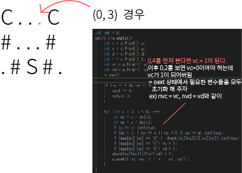

## 알고리즘 - 배달(bfs)

 

 2. next state의 상태 체킹과 실제 표기되는 check 값이 달라도 되는구나?

```
	while (!q.empty()) {
		int x = q.front().x;
		int y = q.front().y;
		int d = q.front().d;
		int t = q.front().t;
		int vc = q.front().vc;
		int vd = q.front().vd;
		q.pop();

		if (vc == 1 && vd == 1) {
			cout << t;
			return 0;
		}

		for (int i = 0; i < 4; i++) {
			int nx = x + dx[i];
			int ny = y + dy[i];
			int nvc = vc;
			int nvd = vd;
			if (d == i) continue;
			if (nx < 0 || nx >= n || ny < 0 || ny >= m) continue;

			// 상태 체킹 시 매개변수는 nvc = 0, nvd = 0이라면
			if (map[nx][ny] == '#' || check[nx][ny][i][nvc][nvd]) continue;
			if (map[nx][ny] == 'C') nvc = 1;
			if (map[nx][ny] == 'D') nvd = 1;
			// 체킹될때 매개변수의 값이 nvc, nvd = 1이면
			check[nx][ny][i][nvc][nvd] = 1;
            // 단, 체킹에 넣는 값과 push 하는 값은 같아야 함.
			q.push({ nx, ny, i, t + 1, nvc, nvd });
		}
	}
```

 3. C를 몇번 방문했는지 차원을 줄일 수도 있다.

 - state라는 값을 두어, 비트마스킹으로 줄일 수 있다.

```
    if(첫번째 C를 방문했다면){
        nstate |= 1;
    }
    else{
        // 두번째 C를 방문했다면
        nstate |= 2;
    }

    if(nstate == 3){
        둘 다 방문했다는 증거가 된다.
    }
```

## 21. 02. 26(금)

 - 다변수에 관련 처리법에 대해 교훈을 준 문제


