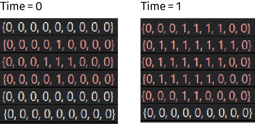

## 알고리즘 - 주난의 난(bfs, dfs)

 - Time 당 1로 둘러쌓인 부분까지 bfs, dfs를 움직임을 제어할 수 있는지가 포인트

 

 1. dfs로 풀기

```
void dfs(int x, int y){
    if(check[x][y]) return;
    check[x][y] = 1;

    for(4방향){
        nx, ny 선언;
        if(범위 초과) continue;
        if(map[nx][ny] == '0') dfs(nx, ny);
        else if(map[nx][ny] == '1'){
            // 1이면 갔다고 표시하고 map을 0으로 바꿔줬던게 핵심
            check[nx][ny] = 1;
            map[nx][ny] = '0';
        }
        else if(map[nx][ny] == '#'){
            isok = true;
            break;
        }
    }
}

while(!isok){
    ans++;
    // 이러면 매 순간 map을 뚫고 원점부터 새로 나아가야 해서 좀 느림
    memset(check);
    dfs(sx, sy);
}
```

 2. bfs로 풀기

```
  queue<pair<int, int>> q, nq;
  void bfs(int x, int y){
      q.push({x, y});
      check[x][y] = 1;
      while(1){
        Time++;
        while(!q.empty()){
            if(x == ex && y == ey) return Time;
            if(범위 체킹) continue;
            if(map[nx][ny] == '0') q.push({nx, ny});
            else nq.push({nx, ny});
            check[nx][ny] = 1;
        }
        // 이후 q는 empty일테고 nq는 있을테니까 nq를 q로 모두 옮김.
        q = nq;
      }
  }
```

## 알고리즘 - 얼음 미로(다익스트라)

 - 미끄러짐을 한 move로 한 다익스트라 연습문제

 - while문 쓸 때 주의점

```
 for(4방향){
     while(1){
         // 기존의 x, y 선언 후
         int nx = x + dx[i];
         int ny - y + dy[i];
         if(범위, map check) continue;
         // 이동가능하면 x, y를 바꿔줘야 한다는 사소한 Tip!
         x = nx;
         y = ny;
     }
 }
 ```

## 알고리즘 - 행렬 곱셈 순서(토너먼트 dp)

 - 토너먼트 dp란 유형으로 정의하자.

 - 전체 범위 s, e에 모든 토너먼트의 경우의 수를 진행하여 얻을 수 있는 값들 중 min 값을 뽑아라는 문제이다.

```
★ Tip : 여기서 범위는 [s, e]로 하는게 편하다.
long long f(int s, int e) {
	long long tans = 0;
	if (s >= e) return 0;
	int a = ary[s].first;
	int b = ary[s].second;
	int c = ary[e].second;
	if (s+1 == e) {
		return dp[s][e] = (long long)a*(long long)b*(long long)c;
	}
	if (dp[s][e] != 3e9) return dp[s][e];
	
    // mid값을 s부터 해야지 ABC의 경우 계산을 할 수 있다.
	for (int m = s; m < e; m++) {
		long long m1 = ary[m].first;
		long long m2 = ary[m].second;
		long long left = f(s, m);
		long long right = f(m+1, e);
		tans = left + right + (a * m2 * c);
		dp[s][e] = min(dp[s][e], tans);
	}
	return dp[s][e];
}
```

## 21. 02. 28(일)

 - dp는 항상 중요하다

 
