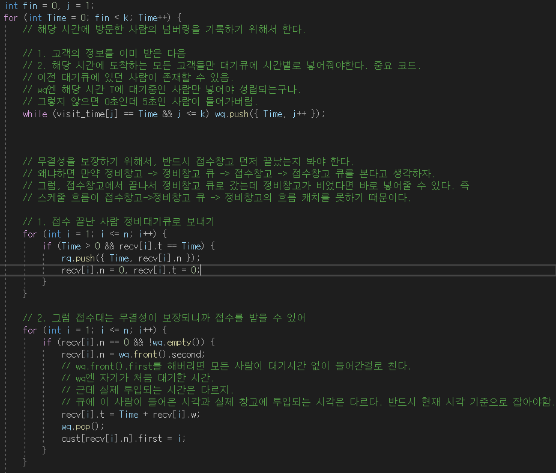
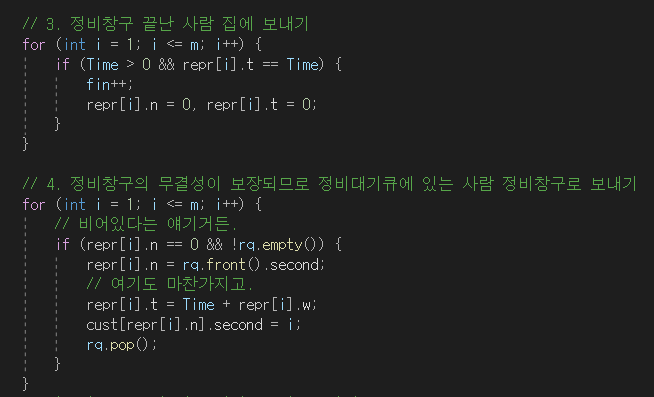

## 알고리즘 - 호텔 방 배정(disjoint-set, 5)

 - 분리 집합의 의미를 잘 파악할 수 있는 코드

 1. map, set 풀이

```
 void solution(vector<long long> room){
     map<long long, int> mp; // 방 배정 여부 체킹용 map
     set<long long> s; // 집합의 부모값만 모아두는 용도의 set

     for(auto x : room){
         if(mp[x]){
            // union-find에서 getparent와 같다.
            // 쿼리에 해당하는 배정 방 집합의 부모를 찾는 과정(find)
            long long t = *s.lower_bound(x);
            mp[t] = 1;
            answer.push_back(t);
            s.erase(t); // 부모의 바로 옆 집합이 또 배정 방 집합인 경우라서
            // union을 해야 하는 상황인 경우 한 집합으로 합쳐야 하니까
            // erase를 해줘야 한다.
            if(mp[t+1] == 0){
                s.insert(t+1);
            }
         } else {
             mp[x] = 1;
             answer.push_back(x);
             // 미배정 방 집합을 짚는 경우는 모두 여기에 오는데
             // 그 경우 중 배정 방의 부모를 짚는 경우가 있는지 체킹하는거지.
             // 방문한 적은 없지만 부모에 쿼리가 들어온 경우
             if(s.find(x) != s.end()){
                s.erase(x);
             }
             // 내가 설정할 집합의 parent값(x+1)이 방문한적없다면
             // 부모값으로 넣어줄 수 있으므로 s에 insert.
             if(mp[x+1] == 0){
                 s.insert(x+1);
             }
         }
     }
 }
```

2. disjoint-set 풀이

```

 ll getParent(int a){
     if(p[a] == 0) return a;
     // 이 부모 설정함수는 잘 생각해봐야함.
     else if(p[a] != a){
         return p[a] = getParent(p[a]);
     }
     // p[a] == a인 경우
     return p[a];
 }
 for(auto x : room){
     // x 쿼리가 속한 집단의 부모를 찾는다.
     long long T = getParent(x);
     answer.push_back(T);
     p[T] = getParent(T+1);
     p[x] = p[T]; // 다음에 해당 쿼리를 짚으면 바로 이 집단의 부모로 갈 수 있게 세팅
 }
 return answer;
```

## 알고리즘 - 내 선물을 받아줘 2(2)

 - disjoint-set 의미가 여기도 같다는 사실

```
 void f(int i, int cnt){
     if(p[i]) return p[i];
     p[i] = cnt;

     if(map[i] == 'E') p[i] = f(i+1, cnt);
     else p[i] = f(i-1, cnt);
     return p[i];
 }
```

 - 두 문제가 집합의 부모를 문제에 맞게 수정하고, union, find 하는 로직이 같음을 이해할 수 있는지 묻는 중요한 문제


## 알고리즘 - 파일 합치기(토너먼트 + dp + bottom-up)

 - top-down으로 재귀로 풀 수도 있지만 재귀는 보통보다 x4배 느리다.

 - 보통 토너먼트 형식으로 모든 경우의 수를 찾은 다음 최대, 최저값을 찾는 로직을 for문으로 설계할 줄 알아야 한다.

```
 ★ 제일 처음 for문은 구간의 길이를 기준으로 돌려야 한다. ★

 // l은 j - i + 1이고 j != i 이므로 최소 2가 되며 구간의 길이는 n까지 가능하다.
 for(int l = 2; l <= n; l++){
     for(int i=1; i+l-1 <= n; i++){
         int j = i + l - 1; // 구간을 처음 돌리며 i, j값 설정 완료
         // 구간을 설정했으면 여기 안에서 k를 돌린다.
         for(int k=i; k<j; k++){
             dp[i][j] = min(dp[i][j], dp[i][k] + dp[k+1][j] + s[j]-s[i-1]);
         }
     }
 }
 ```

## 알고리즘 - 평범한 배낭(Knapsack 1차원)

 - dp[i] : i 이하의 무게를 사용하여 얻을 수 있는 최대가치

 - 여기서 중요한 점은 무게를 배낭의 최대무게부터 item[i] 무게까지 돌린다는 점. 이렇게 하면 한번 사용한 아이템을 재사용하는 일이 없음이 보장된다.


```
 // i는 item number
 for(int i=1; i<=n; i++){
     for(int j=max_back; j>=item[i]; j--){
         dp[j] = max({dp[j], dp[j-1], dp[j-w[i]] + v[i]});
     }
 }
```

## 알고리즘 - 차량 정비소 (5)

 - 봐도 봐도 다시 볼만한 2중 스케쥴링 알고리즘 문제

 

 

## 21. 03. 01 (월)

 - 책을 읽을까 OS 공부를 할까 