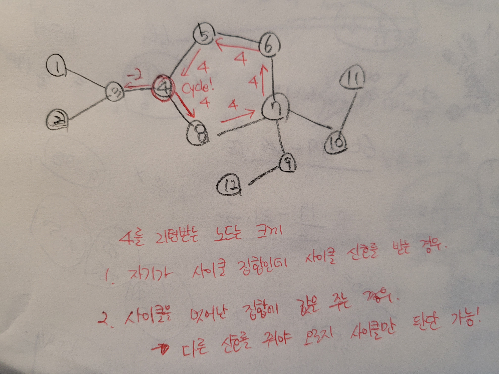

## 알고리즘 - 싸지방에 간 준하(스케쥴링)

 - 강의실 배정 문제보다 어렵고 멀티탭 스케쥴링2 보다 쉬운 정도의 중요한 문제

```
#include<iostream>
#include<algorithm>
#include<vector>
#include<queue>
#include<set>
using namespace std;
int n;
vector<pair<int, int>> sc;
int list[100005];
priority_queue<pair<int, int>> pq;
priority_queue<int> unused; // 사용불가-> 사용가능 한 자리 목록을 번호순으로 저장하는 자료구조 ★
int main() {
	ios_base::sync_with_stdio(0); cin.tie(0);
	cin >> n;
	for (int i = 0; i < n; i++) {
		int a, b; cin >> a >> b;
		sc.push_back({ a, b });
	}
	sort(sc.begin(), sc.end());
	int ans = 0;
	int num = 1;
	for (int i = 0; i < sc.size(); i++) {
		int pqsize;
		if (pq.empty()) {
			pq.push({ -sc[i].second, num });
			pqsize = pq.size();
			ans = max(ans, pqsize);
			list[num]++;
		}
		else {
			if (sc[i].first > -pq.top().first) {
                // 다음 사용자의 이용 시작 시간이 작다면
                // 큐 안에 있는건 모조리 다 빼주면서
                // unused에 넣어줘야 하는 테크닉. 중요중요
				while (!pq.empty() && (sc[i].first > -pq.top().first)) {
					int num_comp = pq.top().second;
					unused.push(-num_comp);
					pq.pop();
				}
                // 그다음 사용자가 좌석을 사용한다면 unused에도 pop을 해준다.
				pq.push({ -sc[i].second, -unused.top() });
                // 해당 좌석 번호 이용자 현황 배열
				list[-unused.top()]++;
				unused.pop();
				pqsize = pq.size();
				ans = max(ans, pqsize);
			}
			else {
                // 사용불가->사용가능 상태의 좌석이 없고 오로지
                // 미사용 상태인 경우엔 단순히 num값을 추가해 올려준다.
				if (unused.empty()) {
					pq.push({ -sc[i].second, ++num });
					list[num]++;
				}
				else {
                    // 그렇지 않으면 우선순위는 unused에 있으므로 unused 큐에 나온 이용 가능한 좌석 번호를 먼저 사용한다.
					pq.push({ -sc[i].second, -unused.top() });
					list[-unused.top()]++;
					unused.pop();
				}
                // 정답 갱신
				pqsize = pq.size();
				ans = max(ans, pqsize);
			}
		}
	}
	cout << ans << '\n';
	for (int i = 1; i <= num; i++) {
		cout << list[i] << ' ';
	}
	return 0;
}
```

## 알고리즘 - 서울 지하철 2호선(싸이클 판단)

 - 처음 보는 유형의 좋은 문제



 - 처음 노드부터 끝까지 이동했을 때 방문했는데 자기 자신이 나온다면 싸이클이다.

```
 void f(int v, int p){
     if(check[v]) return v;
     for(int i=0; i<node[v].size(); i++){
         int next = node[v][i];
         if(next == p) continue;
         int res = f(next, v);
         // 위 사진의 결과와 같이 사이클 신호를 받다가 원점으로 돌아왔을 때
         // 이 신호를 받으면 즉각 종료해야함.
         if(res == -2) return -2;
         if(res > 0){
             // 사이클 신호를 받았다면?
             // v에 연결된 모든 노드 중 하나라도 사이클이라면 res는 0이상이 된다.
             check[v] = 2; // 사이클임을 표시
             if(res == v) return -2;
             else return res;
         }
         return -1; // 단순 리프노드까지 갔을 때 주는 신호.
     }
 }

 호출 : f(1, 0);
 ```

  - check와 변수 res 하나에서 주는 신호의 차이로 사이클인지 아닌지 판단 가능.

  - 주의할 점은 사이클 노드가 사이클 신호를 받을 때와 사이클이 아닌 노드가 사이클 신호를 받을 때 이를 잘 구분해줘야 한다는 점.

## 21. 03. 07(일)

 - 굉장히 좋은 문제 Nice

