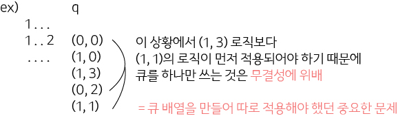

## 알고리즘 - 확장 게임

 - :star: 왜 숫자별로 큐배열을 만들어야 하는지 알 수 있었던 문제

 


## 알고리즘 - 스타트 택시

 - 1. map에 목표지가 여러개의 후보군이 존재할 땐 map 자체에 벽과 구분하여 인덱스 표기를 하는 것이 낫다.
  (벽과 구분하고 싶다면, 벽을 받을 때 -1로 변형시키면 가능)

 - 2. bfs를 하며 check 배열에 dist값을 할당하면 많이 편리하다.

 - 3. 보통 object를 배열이나 벡터로 관리하는데 object 도착 시 소멸에 관해 체킹 잘 해주자.

 - 4. 손님 400명 * bfs 400이니 Object 관리하는 벡터로 쓰는게 일반적임.

 ```
 	while (p--) {
		bfs(sx, sy);
		vector<pair<int, pair<int, int>>> v;
		for (int i = 1; i <= m; i++) {
			if (ary[i].d == -1) continue;
			if (check[ary[i].x][ary[i].y] == -1) {
				cout << -1 << '\n';
				return 0;
			}
			ary[i].d = check[ary[i].x][ary[i].y];
			v.push_back({ ary[i].d, {ary[i].x, ary[i].y} });
		}
		
		sort(v.begin(), v.end());
		
		int ux = v[0].second.first;
		int uy = v[0].second.second;
		if (k < v[0].first) {
			cout << -1 << '\n';
			return 0;
		}
		k -= v[0].first;
		bfs(ux, uy);
		int ex = ary[map[ux][uy] - 1].ex;
		int ey = ary[map[ux][uy] - 1].ey;
		
		if (k < check[ex][ey] || check[ex][ey] == -1) {
			cout << -1 << '\n';
			return 0;
		}
		sx = ex;
		sy = ey;
		
		ary[map[ux][uy] - 1].d = -1;
		map[ux][uy] = 0;
		k += check[ex][ey];
	}
```

 ## 알고리즘 - Object Control Simul 비교

  #### 마법사 상어와 파이어볼

  - 맵의 크기가 50x50 정도면 vector<int> map[50][50] + vector<Ball> v;

    > Object 관리하는 벡터 + 인덱스만 적어두는 벡터 맵 관리 로직으로 풀림.

  - 오브젝트가 최대 많이 움직여봐야 50번이고, Obj는 최대 2500개밖에 없다.

    > 많이 해봐야 2500 * 50 = 125000 정도라서 이땐 이런 로직으로 풀어도 된다.

 ```
  vector<int> map[50][50];
  vector<Ball> v;
  move(){
      vector<Ball> nv;
      // logic
      v = nv; // 살아있는 Ball로 교체해 주는 로직 시도 가능.
  }
 ```

 #### 원자 소멸 시뮬레이션

  - 맵의 크기가 4000*4000 에 Object는 1000개라서 최악의 경우 TLE.

    > 움직임이 4000 * 1000 = 4,000,000 정도 매우 크다면 주의.

 #### 미친 아두이노(vector)

  - 맵의 크기가 100 * 100, Object는 최대 10000개

    > 1,000,000 정도면 object로 충분히 가능.

    > 이때 큐로 풀려고 해보자.

  - 이때, 맵에 이동 표시를 해줘야 하는 경우 + 중복 체킹을 해야 할 때는

  - check[nx][ny]++; 해주고

  - 다시 Object를 순회하며 check[Objx][Objy] > 1이면 소멸 처리.

  - 이때 map에 표시한다.

 #### 미친 아두이노(queue)

  - 살아있는 Object만 다룬다는 점에서 매우 직관적이고 깔끔한 소스

```
 while(time--){
     ssize = q.size();
     while(ssize--){
         // pop하고
         check[nx][ny]++; // 중복 처리
         q.push({nx, ny});
     }

     ssize = q.size();
     while(ssize--){
         if(check == 1){
             q.push({nx, ny});
             map[nx][ny] = 'R';
         }
     }
 }
```

## 21. 03. 29(월)

 - 바쁘게 살자.
