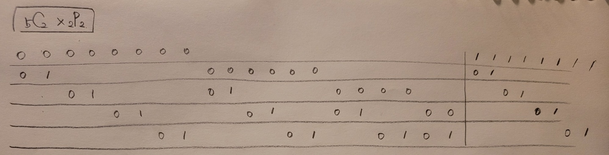

## 알고리즘 - 보호 필름

 - nCr * rP2를 어떻게 코드로 나타내는지 naive하게 짜는 방법을 알아야 했다.

 

 - 그 외에 약품 연속 k개에 대한 로직은 확실히 잡힌듯.

 - 하지만, 약품을 0개 칠하는 Action에 대해서 정답도출이 될 수 있음을 항상 인지.

```
void f(int srt, int dth, int depth) {
	int tmp[22];
	
	if (dth >= depth) {
		bool isok = true;
		for (int i = 0; i < w; i++) {
			int c = 1;
			for (int j = 0; j < d - 1; j++) {
				if (map[j][i] == map[j + 1][i]) c++;
				else c = 1;

				if (c >= k) {
					break;
				}
			}
			if (c < k) {
				isok = false;
				break;
			}
		}
		if (isok) {
			ans = min(ans, depth);
		}
		return;
	}
	for (int i = srt; i < d; i++) {
		if (check[i]) continue;
		check[i] = 1;
		for (int j = 0; j < 2; j++) {
			for (int k = 0; k < w; k++) {
				tmp[k] = map[i][k];
				map[i][k] = j;
			}
			f(i, dth + 1, depth);
			for (int k = 0; k < w; k++) {
				map[i][k] = tmp[k];
			}
		}
		check[i] = 0;
	}
}
```

## 알고리즘 - 달팽이 숫자

 - for{while()} 구조로 가능하긴 한데, n이 1이면 무한루프 돈다는 사실.

 - 로직 자체는 맞는듯 예외 케이스가 있음을 항상 인지하자.

```
		if (n == 1) isok = false;
		while (isok) {
			for (int i = 0; i < 4; i++) {
				while (1) {
					int nx = sx + dx[i];
					int ny = sy + dy[i];
					if (nx <= 0 || nx > n || ny <= 0 || ny > n) break;
					if (check[nx][ny]) break;
					check[nx][ny] = cnt++;
					sx = nx;
					sy = ny;
				}
			}
			if (check[sx + dx[0]][sy + dy[0]]) {
				isok = false;
				break;
			}
		}
```

## 21. 03. 30(화)

 - Gaaaaaaarden 다시 풀어보자. (next_permutation 없이)

 - nCr * rPg 같은 선택류 코딩이 어렵다.