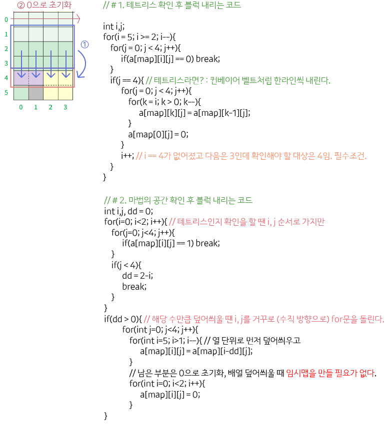

## 알고리즘 - 미네랄 2

 - 1. 미네랄을 없애는 작업 후 클러스터 덩어리를 분리할 수 있는가?

    > O(n*n) bfs 사용하여 덩어리 check 배열에 분리 후 클러스터 별 좌표를 v에 저장.

    > vector<pair<int, int>> v[5005];

 - 2. 분리된 클러스터들의 4방향이 다른 클러스터와 연결되어 있는지 확인할 수 있는가?

    > 각 클러스터의 4방향을 보며 check값이 다른 것이 하나라도 있다면 ok.

 - 3. 아니라면 클러스터를 바닥 or 다른 클러스터 바로 아래까지 떨어뜨릴 수 있는가?

        ```
        void down(int num) {
            vector<pair<int, int>> tv;
            char tmap[105][105];
            memcpy(tmap, map, sizeof(tmap));
            sort(v[num].begin(), v[num].end(), comp);
            bool itok = true;
            while (1) {
                tv = v[num];
                for (int i = 0; i < tv.size(); i++) {
                    int x = tv[i].first;
                    int y = tv[i].second;
                    if ((check[x + 1][y] != 0 && check[x + 1][y] != num) || x + 1 >= r) {
                        // 클러스터가 타 클러스터와 인접하거나 바닥인 경우 false
                        itok = false;
                        break;
                    }
                }
                // 끝까지 떨어졌으므로 break
                if (!itok) break;
                else {
                    // 아니면 클러스터 덩어리의 위치를 한칸씩 내려준다.
                    for (int i = 0; i < v[num].size(); i++) {
                        v[num][i].first++;
                    }
                }
            }
        }
        ```

## 알고리즘 - 화살표 미로(Easy)

 - 1. 같은 좌표라도 주문서의 개수에 따라 다르단 사실을 check 4차원을 통해 나타낼 수 있는가?

 - 2. dfs 로직 구성 가능한가?

    ```
    void f(int x, int y, int ln, int rn) {
        if (isok) return;
        if (x == r - 1 && y == c - 1) {
            isok = true;
            return;
        }
        if (x < 0 || x >= r || y < 0 || y >= c) return;
        if (check[x][y][ln][rn]) return;
        check[x][y][ln][rn] = 1;
        int nd = -1;
        if (map[x][y] == 'R') nd = 1;
        else if (map[x][y] == 'U') nd = 0;
        else if (map[x][y] == 'L') nd = 3;
        else nd = 2;
        if (ln) {
            f(x + dx[(nd - 1 + 4) % 4], y+dy[(nd-1+4)%4], ln-1, rn);
        }
        if (rn) {
            f(x + dx[(nd + 1) % 4], y + dy[(nd + 1) % 4], ln, rn-1);
        }
        f(x + dx[nd], y + dy[nd], ln, rn);
    }
    ```

## 알고리즘 - 모노미노도미노 2 (Review)

 

 > 1. 배열의 특정 부분을 이동시킬 때, 단방향이라면 임시 배열을 만들지 않아도 된다.

 > 2. 대신 인덱스 처리가 매우매우 까다롭지만 위와 같은 로직을 기억하자.

 > 3. 테트리스 확인법이 매우매우 참신하다.

## 21. 04. 04(일)

 - 3~4주 읏짜
 - 더더 꼼꼼히, 디테일이 생명