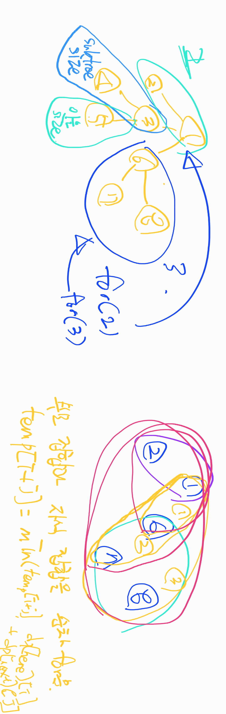

## 알고리즘 - 트리 자르기

 - 참조 : https://jason9319.tistory.com/348

 - 

 - dp[i][j] : i를 루트로 하는 서브트리 내에서 크기를 j로 하는 가장 작은 자른 횟수

 - for문을 두번 돌리는데 첫번쨰 for문을 루트 집합의 size를 , 안쪽에는 자식의 size를 도는 로직이 매우매우 중요하다.

 - dp[i][j] = min(dp[i][j], dp[now][i] + dp[next][j])

```
int dp[151][151], n, m, x, y, sz[151], tmp[151], res;
vector<vector<int>> vt;
void dfs(int here, int par) {
    sz[here] = 1;
    dp[here][1] = 0;
    for (int next : vt[here]) {
        if (next == par)continue;
        dfs(next, here);
        memset(tmp, 0x3f, sizeof(tmp));
        // 현재 노드사이즈는 재귀를 타면서 증가할 수 있다.
        // 역 bfs니까 이으면서 현 노드의 사이즈가 커질 수 있음.
        for (int i = 1; i <= sz[here]; i++) {
            // 이건 subtree의 개수만큼 for문을 도는구나.
            for (int j = 0; j <= sz[next]; j++) {
                if (!j)tmp[i + j] = min(tmp[i + j], tmp[i] + 1);    //j가 0이라는건 자식을 잘라내겠다는 걸 의미
                else
                    // 부모 집합까지 i를 유지할때 드는 최솟값 +
                    // 자식 집합까지 j를 유지할때 드는 최솟값을 더해야 묶지.
                    tmp[i + j] = min(tmp[i + j], dp[here][i] + dp[next][j]);
            }
        }
        // tmp 하지 않고 dp[here][i+j]로 하면 안되는 이유까지도 찾아봐야 한다.
        sz[here] += sz[next];
        for (int i = 1; i <= sz[here]; i++)
            dp[here][i] = tmp[i];
    }
}
```

## 21. 05. 12 (수)

 - 트리라는 자료구조를 완벽히 다룰줄 알때까지 계속 보자
