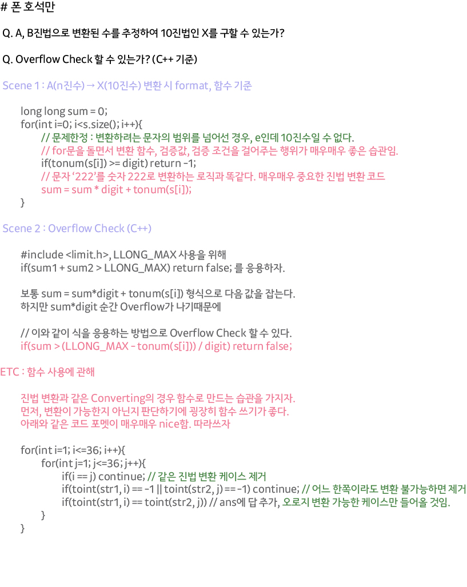

## 알고리즘 - 마법사 상어와 비바라기

 :star: 맞왜틀 이유를 찾는덴 assert 함수를 이용하자.

 - 구름이 하나도 생기지 않을 때 에러가 났음을 인지. But 어디서 오류를 냈는진 알 수 없었다.

 - 원인 : **구름이 하나도 없어도 문제의 5번 로직이 적용되게끔 짜야 하는데 그러지 못함.** :star:

 - Hidden Case : 구름이 없을때도 로직을 잘 타는지 물어보는 케이스

 > 수정 전 코드

 ```
 for(int i=0; i<m; i++){
		_set.clear();
		cin >> d >> s;
		if (i == 0) {
			v.push_back({ n - 1, 0 });
			v.push_back({ n - 1, 1 });
			v.push_back({ n - 2, 0 });
			v.push_back({ n - 2, 1 });
		}
        // assert(v.size() != 0); // Hidden 여기서 걸림.
		if (v.size() == 0) {
            // 구름이 없다면 움직여봤자 아무런 소용이 없을 줄 알고 break 거는 실수.
            // But. 없어도 5번 로직은 타야 했음.
			break;
		}
		else {
			go(d, s);
		}
        // 5번 로직.
        // 아래 코드는 go 함수 안에 존재했었음.
		for (int i = 0; i < n; i++) {
			for (int j = 0; j < n; j++) {
				//assert(map[i][j] >= 0);
				if (_set.find({ i, j }) != _set.end()) continue;
				if (map[i][j] >= 2) {
					v.push_back({ i, j });
					map[i][j] -= 2;
				}
			}
		}
	}
```

> 수정 후
```
for(int i=0; i<m; i++){
		_set.clear();
		cin >> d >> s;
		if (i == 0) {
			v.push_back({ n - 1, 0 });
			v.push_back({ n - 1, 1 });
			v.push_back({ n - 2, 0 });
			v.push_back({ n - 2, 1 });
		}
		
		//assert(v.size() != 0);
		if (v.size() > 0){
			// 구름이 있을때만 구름에 대한 로직만 함수로 따로 파서 진행하는 습관 ★
			go(d, s);
		}
        // 구름이 없더라도 5번 로직은 타야 했다.
		for (int i = 0; i < n; i++) {
			for (int j = 0; j < n; j++) {
				//assert(map[i][j] >= 0);
				if (_set.find({ i, j }) != _set.end()) continue;
				if (map[i][j] >= 2) {
					v.push_back({ i, j });
					map[i][j] -= 2;
				}
			}
		}
	}
```


## 21. 06. 05(토)

 - 꾸준히 성장하길