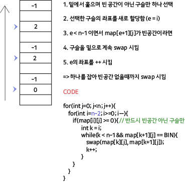

## 알고리즘 - 상어 중학교 (2)

 > Point 1. 무지개 구슬을 포함한 Group 판단, bfs 시 무지개 구슬만 중복 체킹이 되어야 하는데 이를 어떻게 판단하는가?

 - 중복 체킹될 수 있는 무지개 구슬은 칠하지 않고, 원색 구슬만 체킹하는 기법을 사용 **(if(map[x][y] > 0) chk[x][y] = 1)**

 - 애초에 퍼질때 원색 구슬만 최초 퍼지는 구슬로 들어가게 해놓음.

 > Point 2. Group 판단 후 얻은 정보들이 꽤나 많고 sort 해야 하는데, 이를 어떻게 쉽게 할지?

 - 임의의 pair를 정의한 후 max값을 적용하는 방식이 깔끔하다.

 ```
 pair<pii, pii> mx = {{-1, -1}, {-1, -1}};

for(){
    for(){
         pair<pii, pii> ret = bfs(x, y);
         mx = max(mx, ret); // 갱신
    }
}

if(mx.first.first < 2) break;

```

 > Point 3. swap 하여 중력을 가하는 행위에 대한 포멧 구성은 어떻게 하는지?

 

 ## 21. 07. 12(월)

  - 워라벨 잘 챙기고 살빼구 스트레스 관리 잘하구