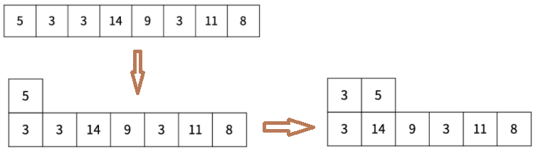
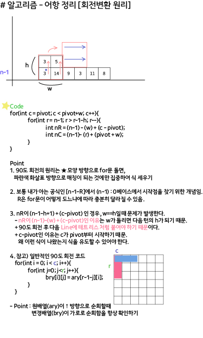

## 알고리즘 - 어항 정리

1. 배열이 이동하며 위치가 자주 바뀌는 상황에서, 벡터 배열(vector<int> v[100])이 아닌 배열(int v[100][100])로 해결할 수 있는가?

 - 이 문제가 어려운 이유는, 벡터 배열의 내용 <-> 일반 배열로 switching이 자유자재로 가능해야함. 이런 어려움의 이유는 **벡터 배열을 선언했기 때문**.

2. 아래 그림처럼 변하는 배열을 보고, ary[N][i]로, **행을 N단에 고정시킬 생각을 할 수 있는가?**



> =======================================

Tip 1. 배열 순회하며 **최솟값 갱신과 해당 위치를 동시에 알아내는** 방법

```
// i,j의 위치를 담을 벡터 선언 (중요)
vector<pair<int, int>> pos;
for(row){
    for(col){
        // 빈 값은 제외
        if(ary[i][j] == 0) continue;

        // 최솟값에 해당하는 어항 찾기
        if (ary[i][j] < mn){
            mn = ary[i][j];
            // 최솟값 갱신이 되면 clear
            pos.clear();
            pos.push_back({i, j});
        }
        // 최솟값과 같은 값이 있다면?
        else if (ary[i][j] == mn){
            pos.push_back({i, j});
        }
    }
}

// 최솟값과 같은 위치의 배열은 모두 +1씩 해준다.
for(auto x : pos){
    ary[x.first][x.second]++;
}
```



## 22. 03. 19 ~ 20(일)
 - 오랜만에 해보는 알고리즘
 - 다시 하자. 꾸준히

