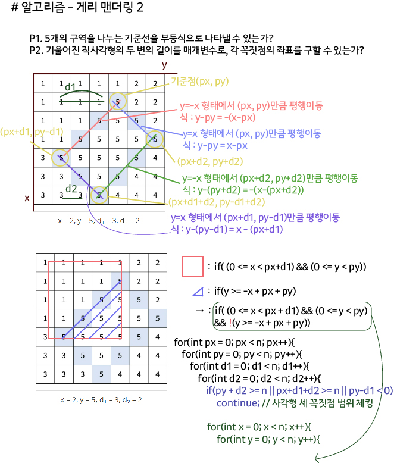

 > 수학적인 직선 Graph로 범위 나누는 행동을 프로그래밍적으로 어떻게 처리할 수 있을지 생각하기 좋은 문제


## 알고리즘 - 소용돌이 Format

> :star: 종료조건을 완벽히 설정할 수 있는가? :star:

```
소용돌이 Format
// isok 변수는 필수이며, 가장 내부에서 event 발생시킨다.

bool isok = false;
while(1){
    if(isok) break;

    for(int d=0; d<2; d++){
        if(isok) break;
        for(int c=0; c<cnt; c++){
            int nx = sx + dx[now_dir];
            int ny = sy + dy[now_dir];

            if(nx < 0 || nx >= n || ny < 0 || ny >= n){
                isok = true;
                break;
            }

            map[nx][ny]++;

            sx = nx;
            sy = ny;
        }
        now_dir = (now_dir + 1) % 4;
    }
    cnt++;
}

```

## 알고리즘 - 육각좌표 회전 방법

> Format

```
// 1. dx, dy 잡는법부터 알아야한다.
// dx[6] = {-1, -2, -1, 1, 2, 1};
// dy[6] = {1, 0, -1, -1, 0, 1};

// 2. [0->[1]->2->3->4->5->0]의 순서로
// 느낌 기억할것.

for(int i=1; i<=껍질수; i++){

    // 기준점은 계속 내려가며, 반드시 한칸씩 올라온다.
    sx = sx + dx[0];
    sy = sy + dy[0];
    f(sx, sy);

    // 1연산은 ↑ 방향이고, 1연산은 껍질수보다 적게 감을 잊지말자.
    for(int j=1; j<i; j++){
        sx = sx + dx[1];
        sy = sy + dy[1];
        f(sx, sy);
    }

    for(int j=1; j<=i; j++){
        sx = sx + dx[2];
        sy = sy + dy[2];
        f(sx, sy);
    }

    for(int j=1; j<=i; j++){
        sx = sx + dx[3];
        sy = sy + dy[3];
        f(sx, sy);
    }

    for(int j=1; j<=i; j++){
        sx = sx + dx[4];
        sy = sy + dy[4];
        f(sx, sy);
    }

    for(int j=1; j<=i; j++){
        sx = sx + dx[5];
        sy = sy + dy[5];
        f(sx, sy);
    }
    
    for(int j=1; j<=i; j++){
        sx = sx + dx[0];
        sy = sy + dy[0];
        f(sx, sy);
    }
}


 ## 22. 03. 26(토)

  하기 싫어지고 귀찮지만 반드시 하자