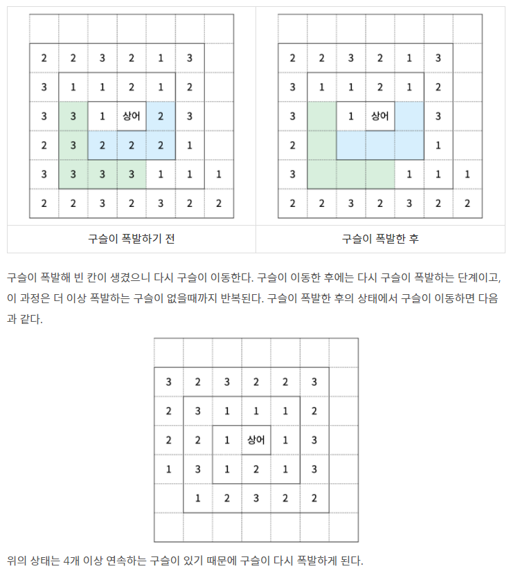

## 알고리즘 - Obj CRUD 운영법 (2)

> Case 1. 마법사 상어와 파이어볼

```
 P1. 'Object' now[Obj_MAX] + 'Object' next[Obj_MAX] + Object map[R][C] 이 구조로 풀었다.

 P2. 대부분의 풀이를 봐도 Object에 idx를 넣는 멍청한 짓은 하지 않았다.

 P3. 생각보다 'Object' ary[Obj_MAX] 형태로도 자주 푸는 것이네?

 P4. Object map[R][C]에 내 now형태의 값을 집어넣을 수 있다. 

 for (int i = 0; i < cidx; i++) {
    // Object의 멤버변수 별 1:1 매칭을 통해 ary값을 map에 바로 옮길 수 있다.
	map[fireball[i].x][fireball[i].y].m += fireball[i].m;
	map[fireball[i].x][fireball[i].y].s += fireball[i].s;
	if (fireball[i].d % 2 == 0) map[fireball[i].x][fireball[i].y].even++;
	else map[fireball[i].x][fireball[i].y].odd++;
}

 P5. queue가 아닌 배열로 next state를 표현할땐, 현재 살아있는 Object 개수를 카운팅 하고 있는게 매우 중요하다.

  - Object가 유지한다면, now -> next 옮겨가는 과정에서 count++ 해주자.

  - Object가 생성된다면, 생성하는 시점에서 count++ 해주자.

```

## 알고리즘 - 마법사 상어와 블리자드

1. 소용돌이 Format 사용할 수 있냐?

2. 순회하는 방향이 매우 독특한데, 이를 vector<pair<int, int>>라는 자료구조로 나타낼 수 있느냐?

3. Tetris!


 - 재료 1: 현재 내가 가리키고 있는 숫자를 담을 변수(now)

 - 재료 2: Cnt 변수, 시작은 1로.

 - 상황 1 : 순회하는 값이 now값과 같을 경우(연속된 상황)
    + vector<'value'>에 연속하는 값을 넣어준다. [push_back]
    + Cnt 변수를 올려준다.

 - 상황 2 : 연속이 아닐 경우
    + cnt 개수가 조건을 넘는지 확인 후, 해당 개수만큼 res.pop_back();

    + 다 지우고 나서 **꼭 현재 value를 push_back해주고, now와 cnt값 갱신**한다.

    + for문 다 돌고 나서 남은 연속된 값이 있을 수 있다. 그러니, tetris 해주는 부분만 다시 확인.

> FULL CODE ↓

```
int cnt = 1;
int now = -1;
vector<object> res;
for(auto x : obj){
    if(x == now){
        res.push_back(x);
        cnt++;
    } else {
        if(cnt >= 4){
            while(cnt--)res.pop_back();
        }
        res.push_back(x);
        cnt = 1;
        now = x;
    }
}

if(cnt >= 4){
    while(cnt--) res.pop_back();
}
```

## 알고리즘 - 상어 중학교

 - bfs 여러개가 중복되는 Object를 조회할 수 있는 개념 처리를 어떻게 할 것인가?

 - 중력 개념을 어떻게 Nice하게 구현할 수 있는가?

```
void gravity() {
	for (int j = 0; j < n; j++) {
        // 중력의 개념 첫번째. 시작점을 n-1이 아닌 n-2로 잡는다.
		for (int i = n - 2; i >= 0; i--) {

            // 빈 벽이 아닌 구슬이 있다면
			if (map[i][j] >= 0) {
                // 해당 행값을 e에 저장시킨다음.
				int e = i;

                // 중력을 가하고자 하는 다음 공간이 n 안이며, 빈 벽(-2)라면 swap 후 e값을 한칸 아래로 내린다.
				while (e + 1 < n && map[e + 1][j] == -2) {
					swap(map[e][j], map[e + 1][j]);
					e++;
				}
			}
		}
	}
}
```

## 22. 03. 28(월)

 - 시간이 얼마 남지 않음. 원복 하고 반드시 All을 목표로 하자.