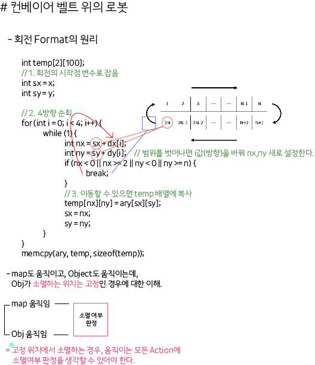

## 알고리즘 - 컨베이어 벨트 위의 로봇(2)

 > 왜 50분이나 걸렸는가?

 1. 회전 로직이 논리적으로 생각이 나지 않음.

 MY CODE
 ```
 int dx[4] = { 0, 1, 0, -1 };
	int dy[4] = { 1, 0, -1, 0 };

	info tmap[2][105];
	int check[2][105] = { 0, }; // 이러면 전체 초기화되냐?
	int d = 0;
	int sx = 0, sy = 0;
	memset(check, 0, sizeof(check));

	while (1) {	
		int nx = sx + dx[d];
		int ny = sy + dy[d];
		if (nx < 0 || nx >= 2 || ny < 0 || ny >= n) {
			d = (d + 1) % 4;
			continue;
		}
		if (check[nx][ny] == 1) break;
		tmap[nx][ny] = map[sx][sy];
		check[nx][ny] = 1;
		sx = nx, sy = ny;
	}

	memcpy(map, tmap, sizeof(tmap));
 ```

 Format Code
 ```
    // 회전할 시작점 하나를 변수로 잡는다.
 	int sx = x;
	int sy = y;

    // 4방향 순회한다.
	for (int i = 0; i < 4; i++) {
        // 단, 방향 당 경계 범위까지 모두 순회.
		while (1) {
			int nx = sx + dx[i];
			int ny = sy + dy[i];

            // 경계를 벗어났다면 break.
			if (nx < 0 || nx >= 2 || ny < 0 || ny >= n) {
				break;
			}


			temp[nx][ny] = ary[sx][sy];
			sx = nx;
			sy = ny;
		}
	}
	memcpy(ary, temp, sizeof(temp));
 ```

 :Format:을 외우라기보단 왜 이 코드가 순회할 수 있는지 원리를 알아야함.

 

 
## 22. 04. 02(토)

 - 이미 본 문제를 Object CRUD 관점에서 상황 별 분류 및 대응방안 탐구