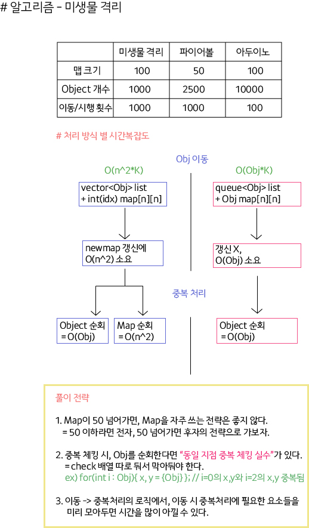

## 미친 아두이노 - O(n^2*k) CODE

```
bool move_jongsu(int dir) {
	sx += dx[dir];
	sy += dy[dir];

	if (cnt[sx][sy] > 1) {
		return false;
	}
	return true;
}

bool move_hydra() {
	int next_cnt[105][105] = { 0, };
	
	// 이동할때 next_map 처리.
	// 오로지 obj 이동만 처리하자.
	for (int i = 0; i < lst.size(); i++) {
		int x = lst[i].x;
		int y = lst[i].y;
		int mx = 1e9;
		int mxd = 0;
		for (int j = 1; j <= 9; j++) {
			int nx = x + dx[j];
			int ny = y + dy[j];
			if (mx > (abs(sx - nx) + abs(sy - ny))) {
				mx = (abs(sx - nx) + abs(sy - ny));
				mxd = j;
			}
		}

		if (mxd != 0) {
			int nx = x + dx[mxd];
			int ny = y + dy[mxd];

			if (nx == sx && ny == sy) {
				return false;
			}
			lst[i].x = nx;
			lst[i].y = ny;
			next_cnt[nx][ny]++;
		}
		else {
			assert(0);
		}
	}

	for (int i = 0; i < r; i++) {
		for (int j = 0; j < c; j++) {
			cnt[i][j] = next_cnt[i][j];
		}
	}
	return true;
}

void mod_duple() {

	// 중복 처리 (Object Delete) 할때 새로운 Obj List 갱신.
	vector<ardu> lst_new;

	for (int i = 0; i < lst.size(); i++) {
		int x = lst[i].x;
		int y = lst[i].y;

		if (cnt[x][y] == 1) {
			ardu tmp;
			tmp.x = x;
			tmp.y = y;
			lst_new.push_back(tmp);
		}
		else if(cnt[x][y] >= 2){
			cnt[x][y] = 0;
		}
	}
	lst = lst_new;
}

	for (int i = 0; i < s.size(); i++) {
		int dir = s[i] - '0';
		if (false == move_jongsu(dir)) {
			cout << "kraj " << i + 1 << '\n';
			return 0;
		}

		if (false == move_hydra()) {
			cout << "kraj " << i + 1 << '\n';
			return 0;
		}

		mod_duple();
	}
```

## 미생물 격리 O(Obj*k) Full Code

```
int solution(int m) {
    // O(Obj*k) 코드
	for (int i = 0; i < m; i++) {
        // 이때 n^2가 들어가긴 함..
		memset(check, 0, sizeof(check));
		int qsize = q.size();
		while (qsize--) {
			info now = q.front();
			q.pop();

			int nx = now.x + dx[now.dir];
			int ny = now.y + dy[now.dir];

			if (nx < 1 || nx > n - 2 || ny < 1 || ny > n - 2) {

				// 살아있는것만 따로 q에 push한다.
				if (now.num / 2 > 0) {
					q.push({ nx, ny, now.num / 2, conv_dir(now.dir) });
				}
			}
			else {
				check[nx][ny].cnt++;
				check[nx][ny].sum += now.num;
				if (check[nx][ny].mx < now.num) {
					check[nx][ny].mx = now.num;
					check[nx][ny].dir = now.dir;
				}
				q.push({ nx, ny, now.num, now.dir });
			}
		}

		// state를 옮기는데, 오로지 큐로만 해결.
		int qsize2 = q.size();
		while (qsize2--) {
			info now = q.front();
			q.pop();

			if (check[now.x][now.y].cnt > 1) {
				if (check[now.x][now.y].isok == false) {
					check[now.x][now.y].isok = true;
					q.push({ now.x, now.y, check[now.x][now.y].sum, check[now.x][now.y].dir });
				}
			}
			else {
				q.push({ now.x, now.y, now.num, now.dir });
			}
		}
	}
	int ans = 0;
	while (!q.empty()) {
		ans += q.front().num;
		q.pop();
	}
	return ans;
}
```

 - mapsize가 크면 그냥 큐 형식으로 풀려고 하고,
 - map[x][y] 형식을 마구잡이로 쓰기엔 위험함을 인지.
## 22. 04. 03(일)

 - 계속 계속 후회없이


