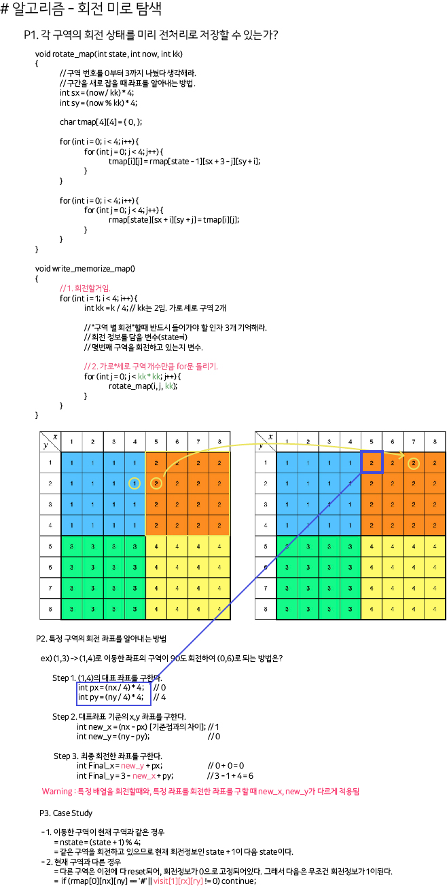

## 알고리즘 - 벽 부수고 이동하기

 > next 상태에 대한 여러가지 사례 탐구하며 헷갈리지 않아야함.

 - check[nx][ny][b] : "**x,y 위치에서 벽 부순 횟수가 b**이며, nx,ny를 보고있는 상태"

```
    for (int i = 0; i < 4; i++) {
		int nx = x + dx[i];
		int ny = y + dy[i];
		if (nx <= 0 || nx > n || ny <= 0 || ny > m) continue;
			
		// 벽이면서 벽을 부수지 않았다면?
		// 벽이면서 벽을 더 부술 수 있고 지금 상태가 0이라면?
		if (map[nx][ny] == '1' && b == 0 && check[nx][ny][b] == 0) {
			// 벽을 부쉈음을 나타내는 체크에 표시.
			check[nx][ny][b + 1] = 1;
			// 다음 큐엔 벽을 부순 상태임을 반드시 같이 넣을 것.
			q.push({ {nx, ny}, {b + 1, dist + 1} });
		}
			
		else if (map[nx][ny] == '0' && check[nx][ny][b] == 0) {
			check[nx][ny][b] = 1;
			q.push({ {nx, ny}, {b, dist + 1} });
		}
    }
```

## 알고리즘 - 최단경로 (다익스트라)

 - 포멧 복습

 - pq.pop 꼭 하고

 - 다익스트라는 **단방향**이다. 양방향 Graph 아님!


## 22. 04. 10 (일)

 - 과정은 잊고 결과만 남을것