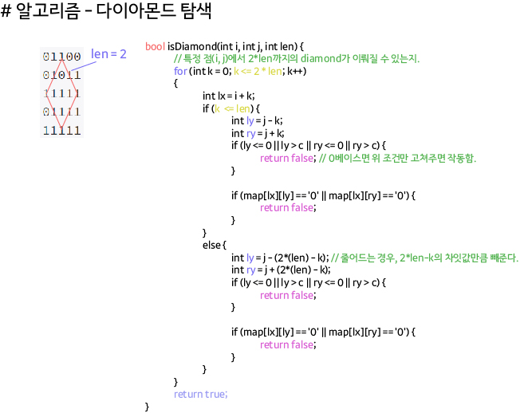

## 알고리즘 - Z

// 특이한 탐색류에 대한 기본 idea를 기억하고 다니자.

```
// 2^n * 2^n 배열에서 (r, c)를 방문하는 순서를 반환함.
int f(int n, int r, int c) {
	if (n == 0) return 0;
	
	int mid = 1 << (n - 1); // 2^n * 2^n 공간을 4분면으로 쪼개는거지.

	// 1사분면에 있는 경우
	if (r < mid && c < mid) {
		return f(n - 1, r, c);
	}

	// 2사분면에 있는 경우
	if (r < mid && c >= mid) {
		return mid * mid + f(n - 1, r, c - mid);
	}

	// 3사분면에 있는 경우
	if (r >= mid && c < mid) {
		return 2 * mid * mid + f(n - 1, r - mid, c);
	}

	// 4사분면에 있는 경우
	return 3 * mid * mid + f(n - 1, r - mid, c - mid);
}
```

## 알고리즘 - 사천성 탐색법.

```

# 몇번을 공부해도 지나치지 않은 좋은 코드.

bool solve(){
    for(int i=0; i<4; i++){
        int nx = x + dx[i];
        int ny = y + dy[i];
        while(1){
            if(nx < 0 || nx >= n || ny < 0 || ny >= n) break;

            if(map[nx][ny] == '.' || map[nx][ny] == find){
                if(map[nx][ny] == find){
                    map[nx][ny] = '.';
                    map[x][y] = '.';
                    return true;
                }

                for(int j=0; j<4; j++){
                    if(i == j || (i == 0 && j == 1) || (i == 1 && j == 0) || (i == 2 && j == 3) || (i == 3 && j == 2)) continue;

                    // 직각방향만 들어오게 되어있다.
                    int nnx = nx + dx[j];
                    int nny = ny + dy[j];

                    while(safe(nnx, nny) && (map[nnx][nny] == '.' || map[nnx][nny] == find)){
                        if(map[nnx][nny] == find){
                            map[nnx][nny] = '.';
                            map[x][y] = '.';
                            return true;
                        }
                        nnx += dx[j];
                        nny += dy[j];
                    }
                    nx += dx[i];
                    ny += dy[i];
                }
            }
        }
    }
    return false;
}

```

## 22. 04. 23 (토)

 - 긍정적인 마음으로