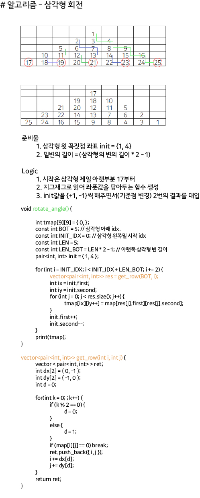

 ## 알고리즘 - 컨베이어 벨트 위의 로봇

  > 어떤 Object가 특정 좌표에서 소멸하는데 이동하는 방법이 2가지인 경우, 두 가지 케이스 모두 소멸 케이스를 고려해줘야한다.

## 알고리즘 - 게리 맨더링

 - 1. bitmasking으로 돌며 1이면 red, 0이면 blue를 vector에 저장.

 - 2. 각 벡터의 가장 앞 후보를 기반으로 bfs 진행.

 - 3. bfs 진행되어 저장된 벡터의 값과 red vector는 멤버와 멤버개수가 같아야함. 아니면 안됨.

 - 4. 모두 통과가 되면 그때서야 blue와 red의 차이를 구해 갱신하고 답 도출함.

## 22. 04. 30(토)

 - 마지막 끝까지 달리자

 