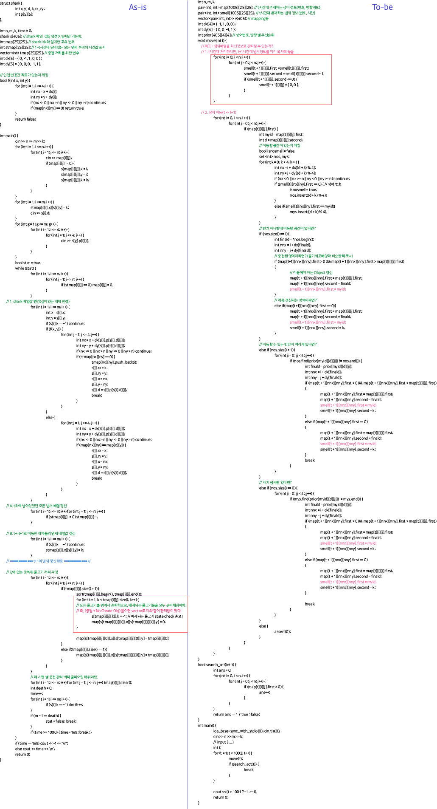

## 알고리즘 - 어른 상어 코드 비교

> As-is 장점

 1. Obj Create가 없을때 구조체 배열 + 벡터로 빠른 인덱스 접근이 가능, 문제에서 Object 고유번호를 다룰 때 좋은듯.

 2. time 차원을 쓰지 않으니 메모리 아낌.

 > 단점

 1. Create 추가 시, delete 되는 오브젝트 관리가 되지 않아 힘듦.

 2. smell 배열이 반드시 이전상태를 겸해 최신 상태를 유지할 수 있어야함.

 > To-be 장점

 1. time 축이 추가되어 now = t, next = t+1로 손쉬운 사용 가능함.

 2. 잦은 Create, delete 시에도 관리가 쉬움

 > 단점

 1. time축을 사용하므로, 조심.

 2. smell 배열 관리 시, 이전 정보를 최신 배열로 n^2*t만큼 넘겨줘야함.

#### :evergreen_tree: 냄새 배열은 최신 정보를 모두 담고있는 배열로, int smell[row][col]꼴로 만들 수 있다. :evergreen_tree:

#### 다만, 해당 냄새를 어느 시점에 재참조하는지 검증해 가며 꼼꼼히 봐야 함

## 22. 10. 02(일)

 - 될때까지

