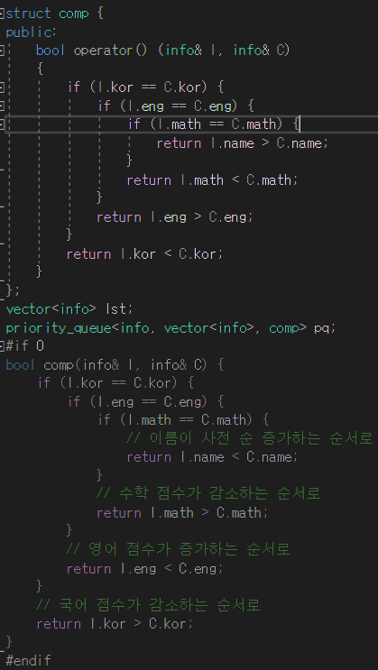

## 알고리즘 - 피로도

- 각 던전의 탐험 순서를 미리 정해두고, 갈 수 있는지 판단하는 좋은 예

```
#include <string>
#include <vector>
#include <algorithm>
#include <iostream>
using namespace std;

int rmax = 0;
int check[8] = {0,};

int isgoing(vector<int>& ord, int k, vector<vector<int>>& d){
    vector<pair<int, pair<int, int>>> lst;
    int ans = 0;
    for(int i=0; i<ord.size(); i++){
        lst.push_back({ord[i], {d[i][0], d[i][1]}});
    }

    sort(lst.begin(), lst.end());
    
    for(int i=0; i<lst.size(); i++){
        int one = lst[i].second.first;
        int two = lst[i].second.second;
        if(k < one) break;
        k -= two;
        ans++;
    }
    return ans;
}
void f(int depth, vector<int> ord, int& k, vector<vector<int>>& d){
    if(depth == d.size()){
        // 순서가 다 정해졌다면 갈 수 있는지 판단
        int lmax = isgoing(ord, k, d);
        if(lmax > rmax){
            rmax = lmax;
        }
        return;
    }
    for(int i=0; i<d.size(); i++){
        if(check[i]) continue;
        check[i] = 1;
        ord.push_back(i);
        f(depth+1, ord, k, d);
        ord.pop_back();
        check[i] = 0;
    }
}
int solution(int k, vector<vector<int>> dungeons) {
    int answer = -1;
    f(0, {}, k, dungeons);
    return rmax;
}
```

## 알고리즘 - 국영수

 - 코테 전 여러번 해도 좋은 Custom Sort 연습
 - pq로 하는거랑 vector에 넣어 하는거랑 둘 다 연습

 

## 알고리즘 - 문자열 파싱 복습

```
void parse(string s){
    vector<string> v;
    int idx = 0;
    string tmp = "";
    for(int i=0; i < s.size(); i++){
        if(s[i] == ' '){
            // 띄워쓴다면 그동안 모아온 tmp를 vector에 넣고
            v.push_back(tmp);
            // tmp 초기화
            tmp = "";
        }
        else {
            // 아니면 계속적으로 넣어줌.
            tmp += s[i];
        }
    }
}
```


