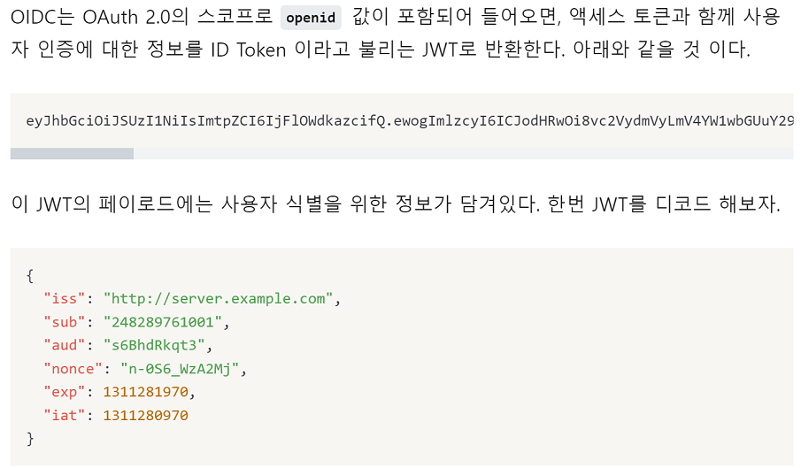

### 240131

## OpenID Connect ?

> 개요
 - As-is : 사용자 데이터를 서비스에서 직접 관리했었다. 이러면, 독자적인 인증 시스템을 각 서비스에서 가졌을 때 사용자가 모든 인증 시스템 정보를 다 외워야 했다.

 - To-be : 운영자는 아주 안전한 웹사이트(구글, 페북, 트위터, 네이버)에 인증 절차를 위임하여, 신뢰할 수 있는 인증정보 하나로 여러 서비스를 이용한다.
- 출처 : https://hudi.blog/open-id/

> OpenID?
 - 인증(Authentication)을 위해 등장한 표준, 인증 프로토콜.
 - OpenID Connect란 OpenID의 3세대 기술이라 생각하자.

### OpenID = (Identity Provider + Relying Party)

 - Idntify Provider
  = 구글, 카카오 같이 OpenID 서비스 제공사.

 - :star: Relying Party :star:
  = OOO으로 로그인하기의 기능을 제공하는 서비스

### OIDC와 OAuth 2.0의 차이
- OIDC의 메인 목적은 인증(Authentication)
- OAuth의 메인 목적은 인가(Authorization)
- OAuth는 호텔 키 카드와 같이 액세스 토큰을 권한으로 제공한다. 하지만 키 카드 소유자의 신원을 알 수 없는 단점이 있다. (인증의 한계점)
- OIDC의 목적은 인증이다. 즉, ID 토큰 (=민증)을 발급받는 형식. 민증이 있다고 호텔 객실에 출입할 순 없다.

### 왜 굳이 OIDC를 쓸까?

- OIDC를 쓰지 않고 OAuth를 쓰면, 두배의 통신을 해야 한다. 결국 인증과 인가를 동시에 하면서, 연산을 줄이기 위해서다.

- OIDC는 OAuth 2.0 스코프(클라가 가져올 수 있는 서버 접근 제한 범위)에 openid 값이 오면, 액세스 토큰과 함께 ID 토큰인 JWT로 반환한다.?

위에 보면 sub 필드가 유저 식별 정보(ID)이다. 그니까 서버 입장에서 유저의 정보를 위와 같은 방식으로 얻어오는 것 같다.

-------------

아래 url과 관련된 궁금증
ex) https://authorization-server.com/auth?response_type=code&client_id=29352735982374239857&redirect_uri=https://example-app.com/callback&scope=openid+email+name

### OAuth 2.0 Spec 문서

#### Next : OAuth 2.0 + OIDC 예제 두드려보자

