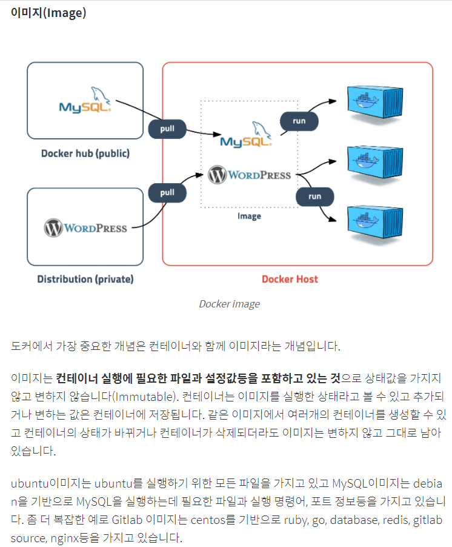
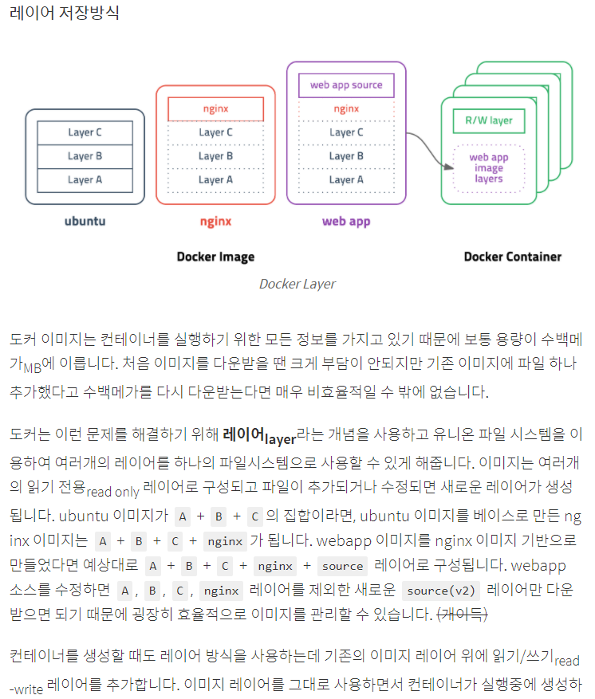

## Docker 공부 내용 정리 :star:

#### Why use Docker? : 도커란 프로세스를 격리시켜 기존의 가상화 하는 방법인 VM의 단점을 해결하기 위해 나온 방식이다.

- 이미지와 컨테이너



- 출처 : https://subicura.com/2017/01/19/docker-guide-for-beginners-1.html



#### Docker 사용 키워드 정리

1. 모든 컨테이너 보기 : docker ps -a

2. 특정 컨테이너에 들어가기 : docker exec -it ${cont_id} /bin/bash

3. 해당 컨테이너에서 담아놓은 이미지 실행법 : mysql -uroot -p와 같은 실행 명령어(환경변수)

4. 도커 이미지 받아오기 : docker run --rm -it ubuntu:16.0.4 /bin/bash

5. 현재 실행 컨테이너 중지 : docker stop ${cont_id}

6. 컨테이너 제거 : docker rm ${cont_id}

7. 도커 이미지 목록 확인 : docker images (컨테이너랑 다름)

8. 옵션 중 -it의 의미는 interactive mode로, 마치 리눅스 이미지 안의 명령어를 수행할 수 있게 하는 명령어라 보면 된다.

#### 단, https://www.popit.kr/%EA%B0%9C%EB%B0%9C%EC%9E%90%EA%B0%80-%EC%B2%98%EC%9D%8C-docker-%EC%A0%91%ED%95%A0%EB%95%8C-%EC%98%A4%EB%8A%94-%EB%A9%98%EB%B6%95-%EB%AA%87%EA%B0%80%EC%A7%80/

- 위 글은 자주 봐라 흔히들 초보들이 실수 할 수 있는 부분이다.

- 도커는 마치 실행 환경만 제공할 뿐 음 영구적으로 실행하기 위해선 무한루프를 돌린다는 등 따로 뭔가 필요하다는 점!?

#### To do list.

- 검색 키워드 : 도커 이미지 배포, 젠킨스 버전 관리 예시, 젠킨스 자동화, 젠킨스 이미지 파일, 도커 pull, 젠킨스 파이프라인, 정적 분석과 동적 분석 개념과 차이

- 소나큐브가 취약점을 잡는 이유에 대해 다시한번 생각해 봐라.

#### Notepad

```
1. 이미지를 배포한다. 그 과정에서 젠킨스 써 보는 걸 해라.

- 자동으로 배포하는데 이 과정에서 변경사항이 생기면 또 이에 따른 이미지를 만들어서 배포해야 한다. 

- (변경 감지 해서 자동 배포, 이때 버전관리를 하는 것을 말하는거지)

2. 젠킨스 빌드 자동화

 - 실행별로 도커 이미지 파일을 만들 수 있다.

 - 버전 별로 이미지 파일을 만들어 보는 것?

3. 

 - ㄱ. 도커에서 이미지를 받아올 수 있다. (pull)

 - ㄴ. 도커에서 이미지(레이어 구도, 재사용 가능) 빌드 한다.

 - ㄷ. 위 ㄴ에서 바뀐 부분만 새로 레이어를 만들고 이를 새로운 이미지로 만드는 것 같아.

 - ㄹ. Jenkins Pipeline에 대하여 검색 ㄱㄱ 이게 뭐지?

 - ㅁ. 젠킨스가 뭔가 명령어를 자동 실행 이런 느낌인가?

4. SonaQube : 정적 분석 툴
 - Q. 정적 분석과 동적 분석이란? 차이는 무엇인가?
 - 어떤 식으로 결과를 내리는가?
```

## 20. 10. 06(화)

 - 첫 출근부터 이런 공부를 하다니.. ㅜㅜ
 - 할 수 있음!