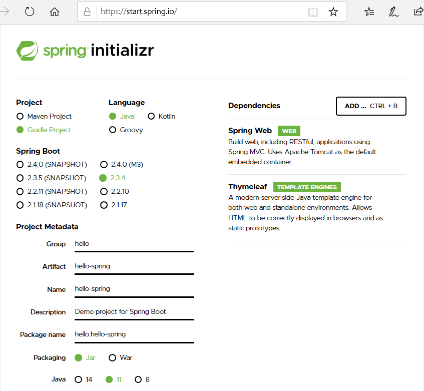
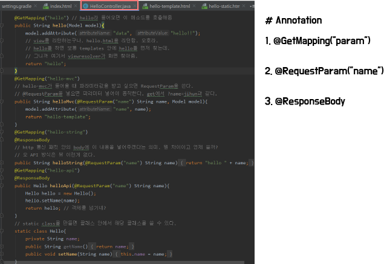

## Spring Boot 강의 정리

 1. 프로젝트 생성법 : https://start.spring.io/

 

 - 위와 같이 설정, Generate 누르면 압축파일 생기는데 그거 풀어서 프젝 폴더에 놔두고 인텔리제이에서 열면 된다.

 - Dependencies가 중요한데 일단 Spring Web, Thymeleaf(템플릿 엔진)을 쓰자.

 2. MVC 패턴 구성을 위한 기본 파일 위치

 

 3. Annotation 사용을 통한 Controller Mapping

 

 4. MVC 방식과 API 방식의 차이

 - MVC : 뷰를 찾고 이를 템플릿 엔진을 통해 화면을 렌더링 한 후 웹 브라우저에 넘겨주는 방식

 - API : HTTP Body 그대로 데이터를 내려준다. @ResponseBody를 만나고 객체가 왔을 때, 디폴트 json 방식으로 응답하는 원리. 보통 객체를 가져올 때 자주 쓰는 방식이다.

 5. 클래스 안에 클래스를 쓸 때 static class를 쓰면 전역변수마냥 자기 클래스에서도 static class를 참조할 수 있다.

 6. 클래스 안에서 멤버 변수는 private, 해당 변수를 끌어다 쓰는 getter, setter는 public으로 선언하는 아주 작은 센스를 가지자. 이것은 java bean 규약이다.

## 20. 09. 29(화)
 - 스프링 부트 재밌다 게시판(CRUD or Login) 정도 만들고 갈 수 있으면 좋을텐데
 
 - 인프런 강의 짱짱맨 명강의 감사감사

 

