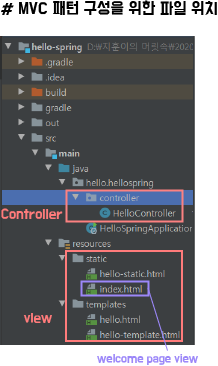

## Spring Boot 강의 정리

 1. 프로젝트 생성법 : https://start.spring.io/

 

 - 위와 같이 설정, Generate 누르면 압축파일 생기는데 그거 풀어서 프젝 폴더에 놔두고 인텔리제이에서 열면 된다.

 - Dependencies가 중요한데 일단 Spring Web, Thymeleaf(템플릿 엔진)을 쓰자.

 2. MVC 패턴 구성을 위한 기본 파일 위치

 

 3. Annotation 사용을 통한 Controller Mapping

 

## 20. 09. 29(화)
 - 스프링 부트 재밌다 게시판(CRUD or Login) 정도 만들고 갈 수 있으면 좋을텐데
 
 - 인프런 강의 짱짱맨 명강의 감사감사

 

