## Spring Boot - 기초 비즈니스 로직 구현과 테스팅 방법 :tree:

 - 웹앱 계층 구조

 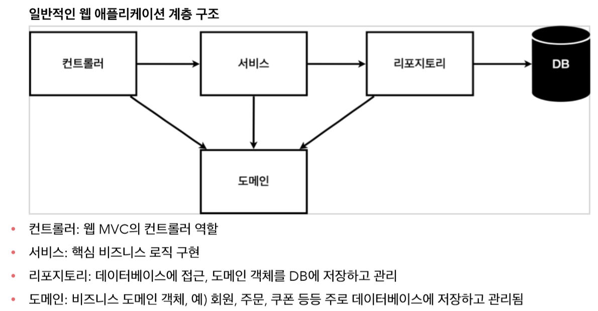

 - 이러한 구조를 package 이름을 주어 만드는 형식으로 돌아간다.
 
 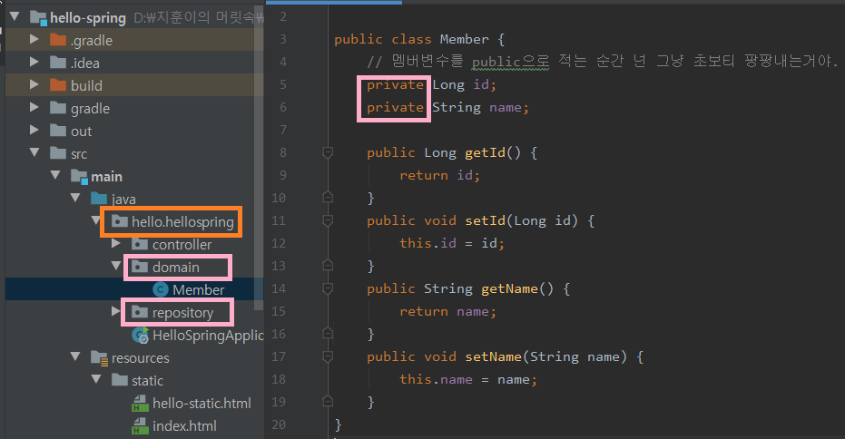

 - 현업에서 사용하는 인터페이스와 비즈니스 로직 디렉토리 구성

 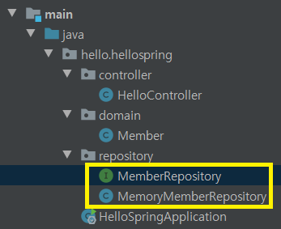

#### 유저 저장소의 네가지 기능 구성법

 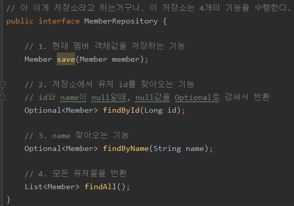

 - 주석에도 있지만 Optional과 List를 자주 사용한다는 점 잊지말자.

 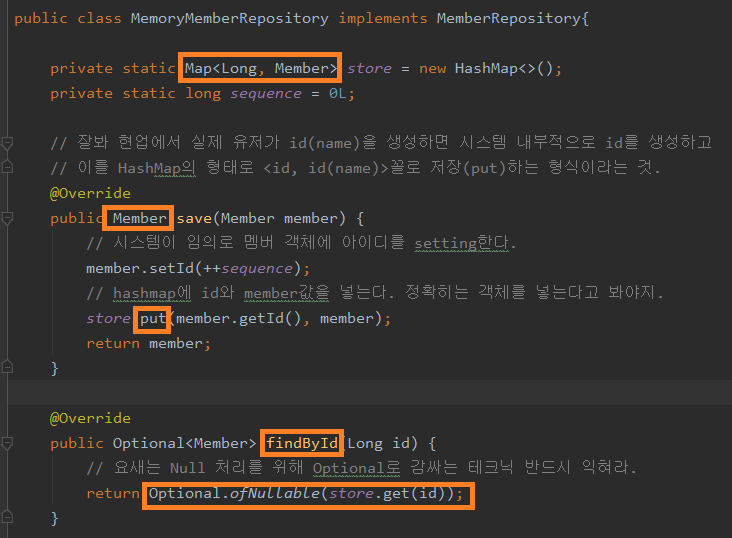

 - find 찾기 기능의 리턴값은 Optional.ofNullable(객체) format으로 익혀도 될 듯.

 - 저장은 객체에 내부 id값 매김 → Hashmap에 넣음 → 객체 리턴의 형식으로

 - 번외 : 동시성 문제란?

    - 두 개 이상의 세션이 하나의 공유 자원에 Read → Write 하려는 경우 현업에서는 ConcurrentHashMap을 쓴다. 이런 이슈도 고려해야 한다는거지.

    - Java 8 이후로 Ramda 사용 + Stream 사용가능 했다는 점! (버전 별 특징)

 ###### Java Stream 사용법

 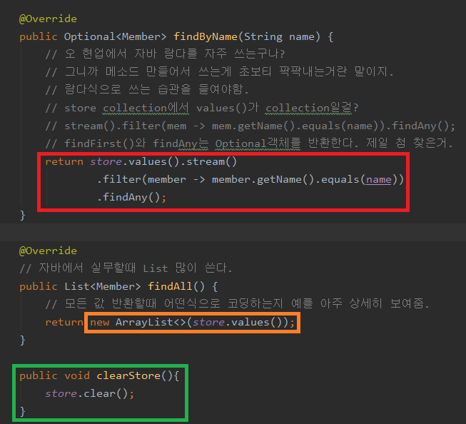

 - https://jeong-pro.tistory.com/165 (Stream 사용)
 - https://coding-factory.tistory.com/265 (Java Ramda 사용)

```
 Stream : 자바 8부터 추가된 기능으로 "컬렉션, 배열등의 저장 요소를 하나씩 참조하며 함수형 인터페이스(람다식)를 적용하며 반복적으로 처리할 수 있도록 해주는 기능"이다.

 Stream : 람다식을 활용하여 수많은 데이터들을 적절히 필터링하고, 가독성 높일 수 있게 하는 메소드, 배열과 컬렉션을 함수형으로 처리할 수 있음.

 주로 배열(Array)와 컬렉션(Collection, List, set)을 처리할 때 걍 이거 쓴다 생각해라.

```

 - hashmap.values() : 해시맵의 모든 킷값을 리스트로 보여줌
 - collections.stream().filter(람다함수) : 특정 로직을 이용해 값을 찾을 때 가독성 높게 처리할 수 있다. 즉, 알고리즘을 쓴다면 이 람다함수 안에서 써야겠지?

 - "모든"이 들어간다면 List고 이 **List는 new ArrayList<>(List)**와 같이 붙어 쓴다고 생각해라.

#### 테스팅 방법

 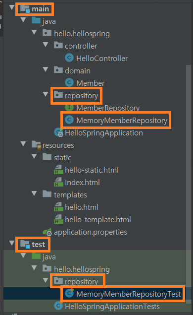

 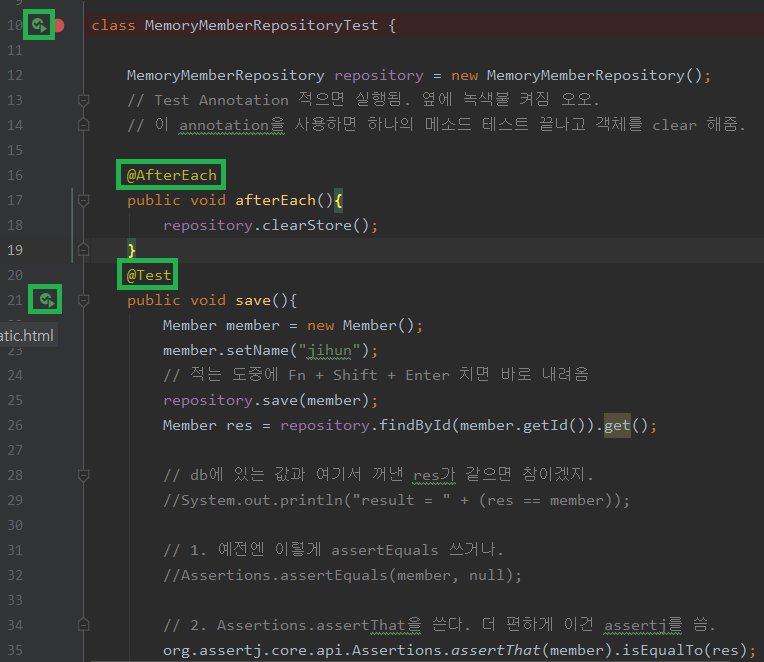

 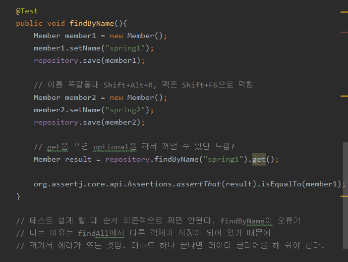

 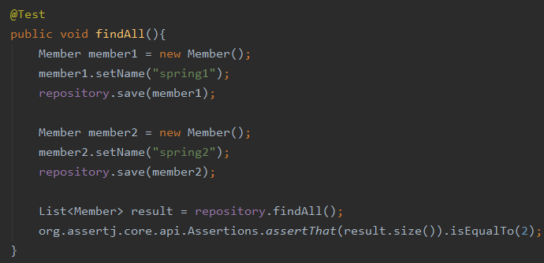

 - 테스팅 할 때 **반드시 @AfterEach 어노테이션을 활용한 clear 작업을 해야 한다.** :star:

 - 그렇지 않으면 아래와 같은 비교 스샷
 
 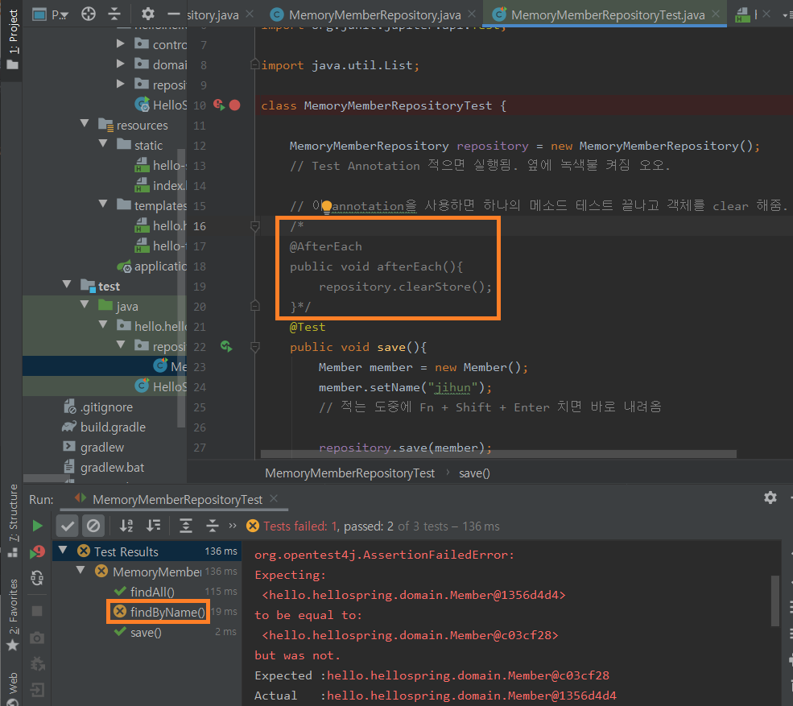

 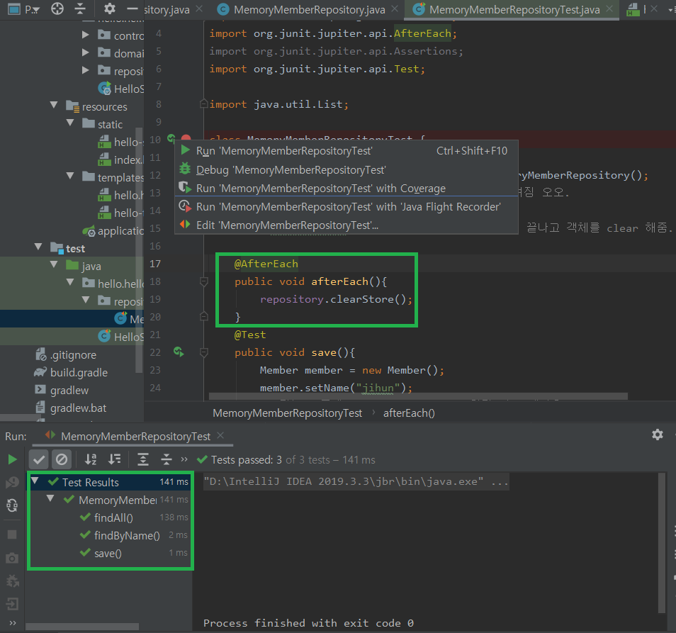

## 20. 09. 30(수)

 - TDD라는게 실제 어떻게 진행되는지 간단하게 해 보았다. 정말 귀중한 시간!

 - 계속 보고 읽고 적응하자. 모두 할 수 있다.


