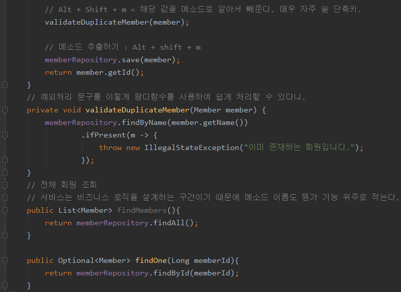

## Spring Boot - 서비스단 구성법, DI 사용 예시

#### Service

 

 

 1. 상위객체 = new 하위객체() 는 다형성을 고려한 설계이며, 이 인스턴스가 상위객체의 제약사항을 따를 것이라는 의미를 내포하고 있다.

 2. Extract method : Alt + Shift + m (해당 로직을 메소드로 알아서 빼줌)

  - Optional 객체가 있다면 예외처리 하는 로직은 ifPresent~ 로 정해져 있다고 생각하자. 외워 외워

#### Testing Service (using DI)

 

 - 위 사진과 같이 하면 알아서 test 폴더에 {name}+Test로 껍데기 까지 만들어 준다.

 

 

 

 - DI의 사용 이유는 서비스단의 로직 실행 객체와 테스트 단의 실행 객체를 일치시키기 위해서라고 말하고 싶다. 이를 위해 서비스 단에서는 반드시 생성자를 만들어 주는 버릇을 들여야 하고

 - 테스트 단에서는 @BeforeEach, @AfterEach 를 사용해서 같은 인스턴스를 사용하게끔 전처리를 해줘야 한다는 말이거든.

## 20. 10. 01(목)

 - 왜 DI를 사용하는지 이유와 예시를 알게 됨. 매우매우x10 중요하다.
 - 적절한 불안함과 스트레스는 마음에 좋다. 