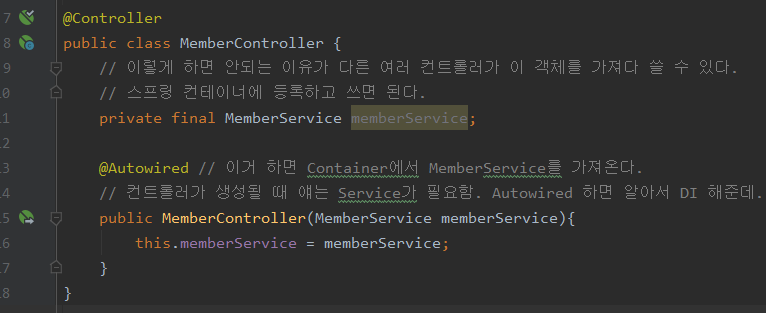
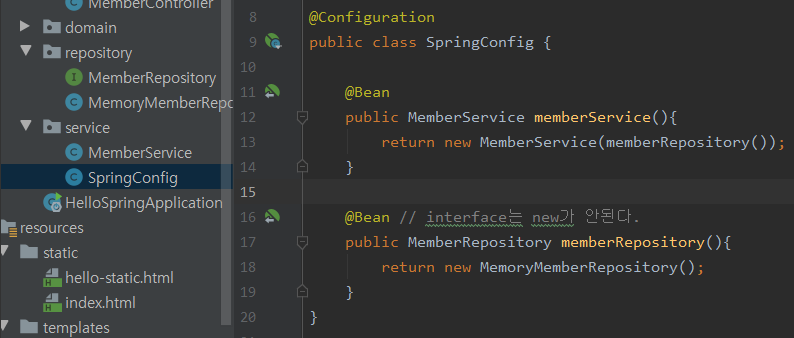
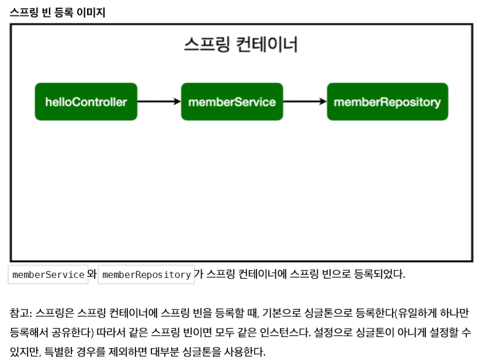
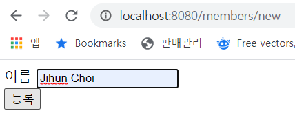
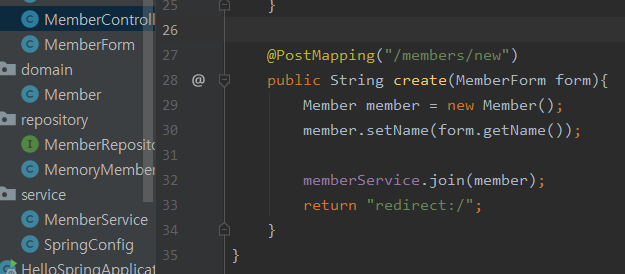

## Spring Boot - Bean 객체 등록 방법 두가지

1. 컴포넌트 스캔 방법

2. 직접 등록 방법 - SpringConfig 클래스를 만들어서 관리

- 이 방법은 나중에 레포지토리 교체 등 "교체"의 상황이 잦게 된다면 쉽게 사용할 수 있는 방법의 장점이 있다.

3. DI를 하는 이유는 컴포넌트에 이러한 로직을 등록하면 의존관계를 좀 더 쉽게 표현할 수 있기 때문이다.

4. DI 의 3가지 방법

 - 생성자를 통한 주입 :star:

 - 필드 주입

 - setter를 통한 주입

#### Annotation에 익숙해져라

- @Component, @Autowired, @Controller, @Service, @Repository, @GetMapping, Test 할 땐 @BeforeEach, @AfterEach, @Test 등등..

5. 웰컴 페이지 역시도 정적 방법(static)과 Controller 등록한 페이지 중 우선순위가 있다. Controller 먼저 뒤져보고 없다면 static한 방법으로 본다는 점.

6. input tag에 입력한 값을 어떻게 받아서 처리할까에 대한 로직

7. JPA란, 객체를 쿼리 없이 바로 DB에 저장할 수 있는 기술이라 보면 된다.

## 20. 10. 05(월)

 - 아아 JPA, DB 접근법, 기본적인 Model을 통한 뷰에 데이터 전달까지 봐놓자.

 
