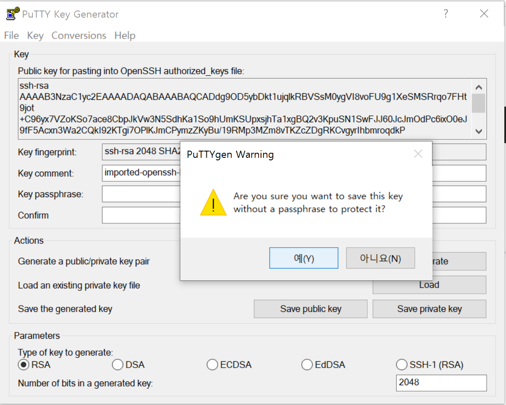
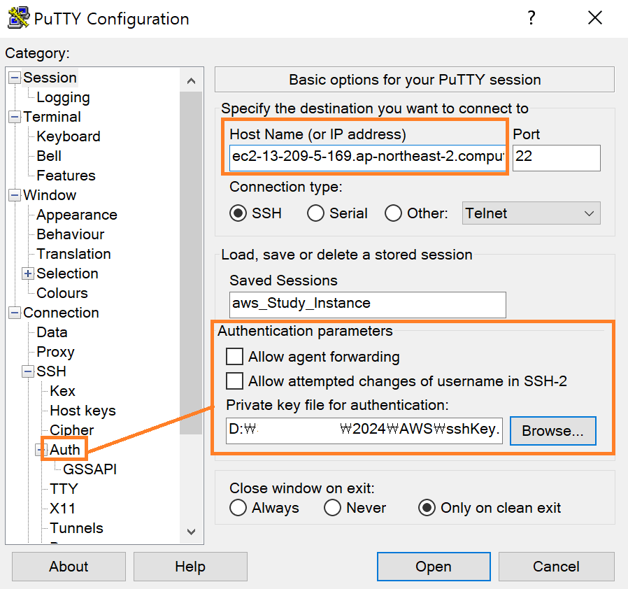
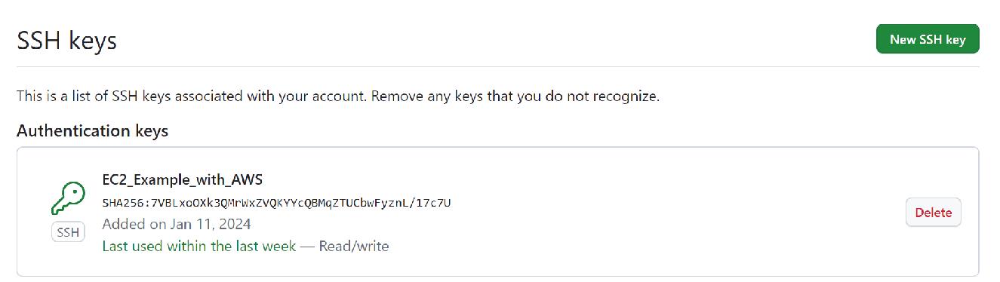
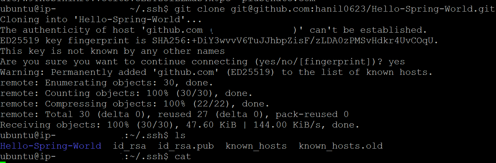

### 240111

#### 1. PEM키 접속 방법

 - 개요
    접속하고자 하는 EC2 서버의 용량이 꽉 차서 지정해 놓은 계정으로 접속할 수 없는 경우 PEM키 접속 방법 사용

 - 방법
    EC2 instance 만들 때 최초 발급되는 (.pem)키를 puttyGen으로 (.ppk)로 변환

아래 Host Name은 EC2 instance의 (**퍼블릭 IPv4 DNS**) 주소 입력 

- login 계정은 EC2의 플랫폼 네임 (우분투로 생성했으면 ubuntu)

#### 2. Hello Spring을 EC2에서 git clone 하기

 - A. EC2 instance에서 git 사용하기 위해선 ssh 인증키가 있어야 한다(공개키 암호화 방식)
   즉, EC2와 git의 Remote가 동일한 키를 가지고 있어야 한다.

 - B-1. EC2에서 ssh Key 생성 : ssh-keygen -t rsa -C {내 git계정메일} (단, 폴더는 ~/.ssh에 존재)

  
 - B-2. git Remote 내 .pub으로 끝나는 공개킷값을 등록

 

 - C. EC2 내 접속하여 git clone → 성공
 

 ###### 내일은 EC2에 자바 설치 + 배포 후 확인 + CodeDeploy 적용 검토 해보자

