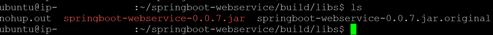
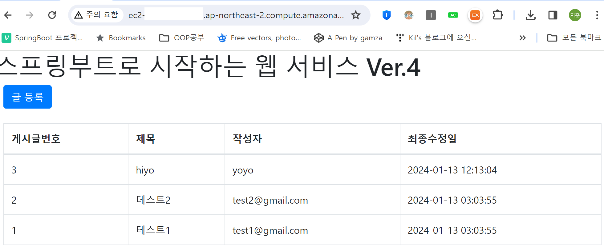
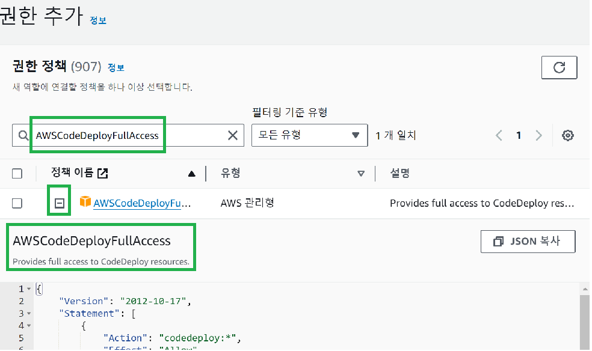
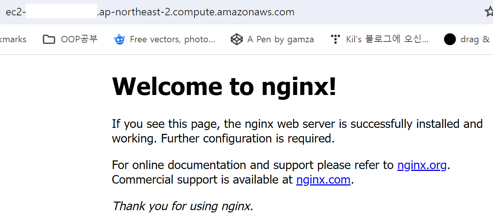
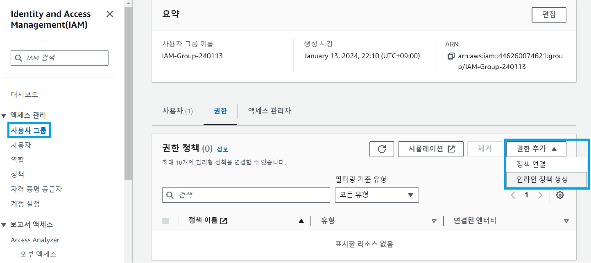
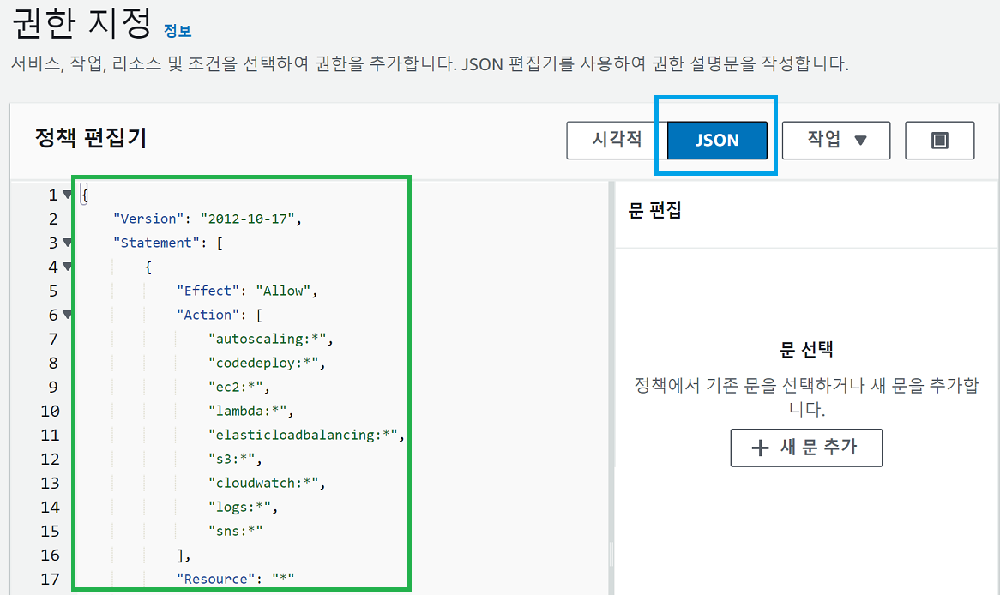
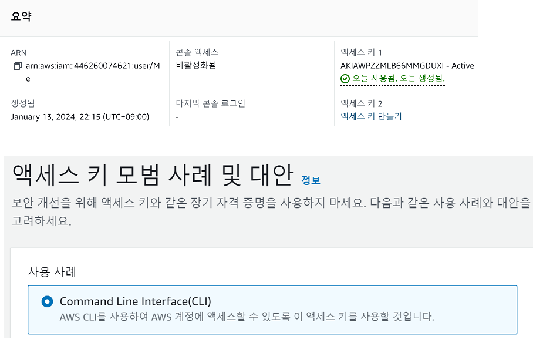

### 240113

### EC2에 Java 설치 + Spring Build + 실행방법

1. Java 설치 : sudo apt install openjdk-8-jdk
  - 단, 내려받은(clone) **프로젝트의 jdk 버전과 같아야** 한다
  - clone한 소스의 jdk : vi build.gradle → sourceCompatibility = 1.8 (8버전)

2. 빌드 진행 : ./gradlew build
 - 정상 빌드 확인 : cd build/libs/{project}.jar 확인
 

3. 빌드 실행 : nohup java -jar {project}.jar % (백그라운드 실행)
 - 끄기 위해선, jobs 입력 → fg %1 입력 시 실행 파일 가져옴 → Ctrl+C

 4. :sparkles:브라우저 접속 성공! :sparkles:
  - https://{Public DNS 주소}:8080
  

----

### CodeDeploy Agent 설치

 - CodeDeploy 요청을 받기 위해선 EC2 내 CodeDeploy Agent 설치 필요

 > Code Deploy 가 EC2 배포하기 때문에 각 서비스 간 Role 설정 필요하다. Code Deploy Role ↔ EC2 Role

 1. EC2 입장에선 S3와 CodeDeploy 서비스의 인바운드 설정이 되어 있어야 한다.
 - IAM → 역할 → 역할 생성 → 사용 사례(EC2)
  AmazonS3FullAccess, AWSCodeDeployFullAccess, AWSCodeDeployRole, CloudWatchLogsFullAccess 추가 후 생성
  

 2. EC2에 nginx 설치
  - sudo apt install nginx
  - sudo service nginx start
  - 이후 https://{Public DNS 주소} 접근 시 아래 화면 확인!

  

 3. Code Deploy → AWS CLI 사용을 위한 사용자 추가 작업
  - IAM → 사용자 그룹 → 인라인 정책 생성
  
  

  - 사용자 추가하기
  
  - 액세스 키 꼭 보관하기!

 4. EC2에 Code Deploy Agent 설치
  - sudo apt install curl unzip
  - curl "https://awscli.amazonaws.com/awscli-exe-linux-x86_64.zip" -o "awscliv2.zip"
  - unzip awscliv2.zip
  - sudo ./aws/install
  - aws --version
  - sudo aws configure
  - 이때, 위 IAM 사용자의 액세스 키(공개키, 개인키) 입력해준다.
  - wget https://aws-codedeploy-ap-northeast-2.s3.amazonaws.com/latest/install
  - chmod +x ./install
  - sudo ./install auto 실행!
  - 실행 확인 : sudo service codedeploy-agent status
  - 재부팅 시 자동 실행하기 위한 스크립트
  - sudo vim /etc/init.d/codedeploy-startup.sh
  ```
  #!/bin/bash 
  echo 'Starting codedeploy-agent' 
  sudo service codedeploy-agent restart
  ```
  - sudo chmod +x /etc/init.d/codedeploy-startup.sh

 ###### 다음엔 CodeDeploy의 아웃바운드 Role 설정하고, CodeDeploy로 배포해 보기!


