### 240116

### CodeDeploy 배포 시스템 만들기

1. EC2 ↔ CodeDeploy 간 IAM Role 생성
 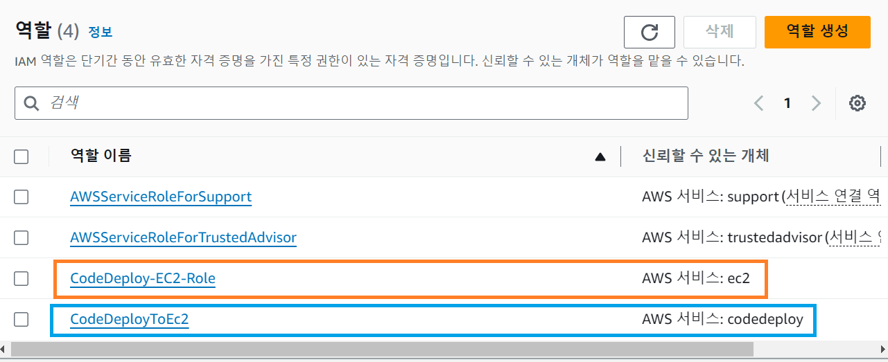
 파란색 : CodeDeploy가 EC2에 접근하기 위한 Role
 주황색 : EC2가 CodeDeploy에 접근하기 위한 Role

2. CodeDeploy 앱 생성

 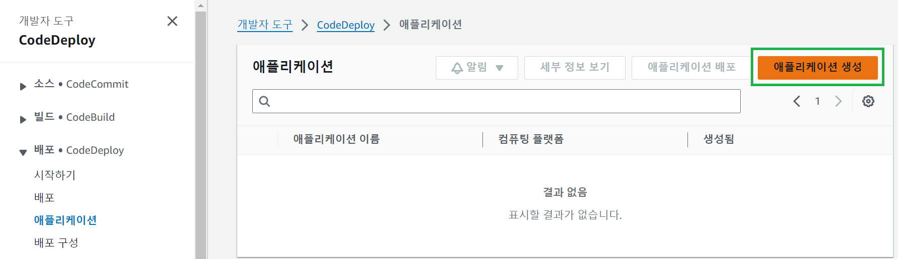

3. CodeDeploy가 배포할 배포 그룹 생성
 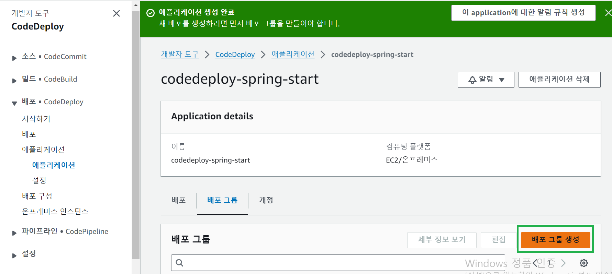

 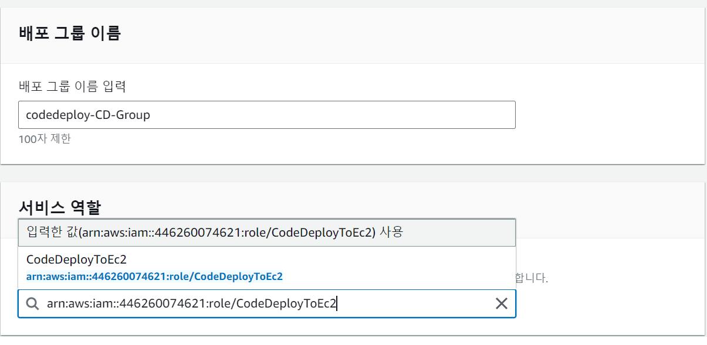

※ 배포 그룹 생성 중 ALB가 있어야 함을 인지..
 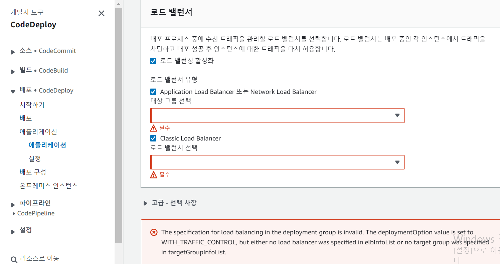

------------------------

### CodeDeploy 배포를 위한 ALB 생성하기

참고 블로그 글 (EC2 HTTPS 연결하기)
 - https://woojin.tistory.com/93 : 도메인 구매 및 ACM 인증서 발급
 - https://woojin.tistory.com/94 : 로드밸런서로 리다이렉트 설정 및 Health Check 통과하기

1. 도메인 구매 (Gabia 사이트에서 구매)

2. ACM 인증서 발급
 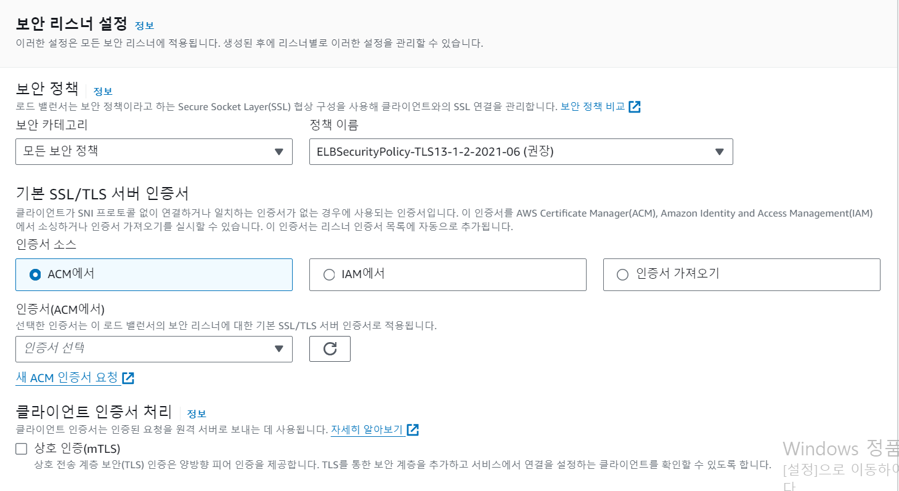
 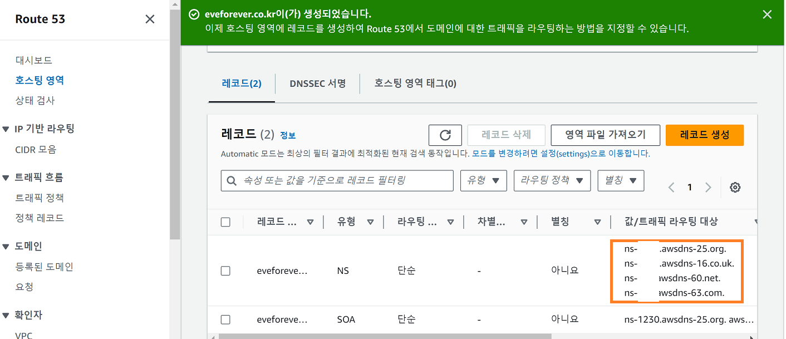
 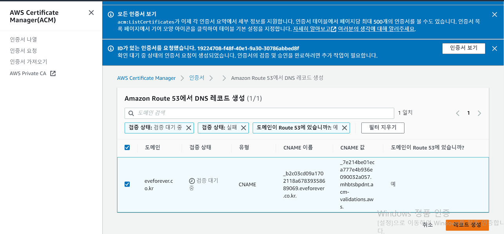

3. 대상 그룹(Target Group) 생성 (ALB가 어디로 보낼 지 그룹핑)
 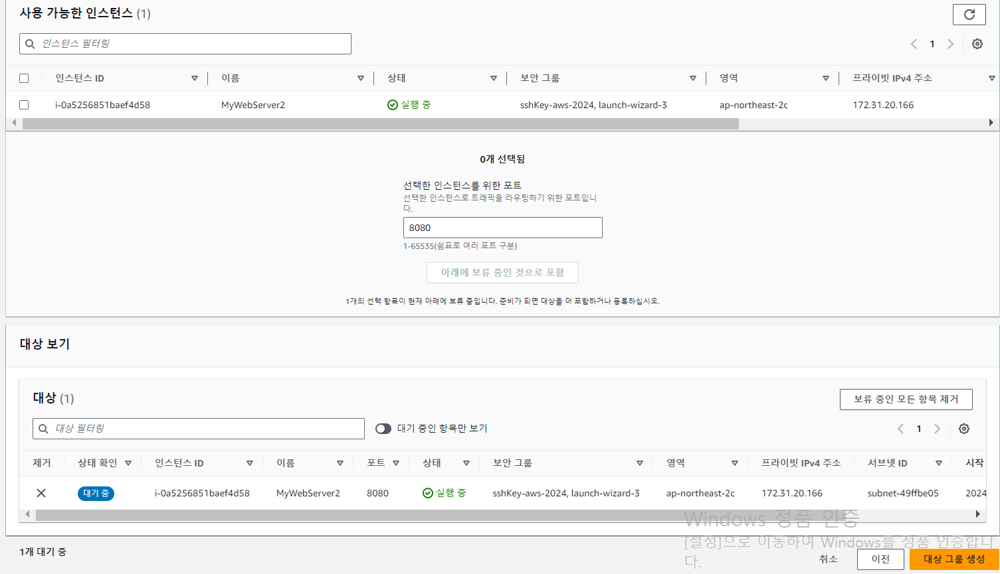

4. Route 53을 통해 생성한 레코드 중 A 레코드 생성 
 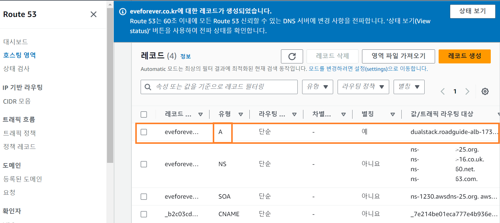

5. 타겟 그룹의 리스너 규칙 확인
 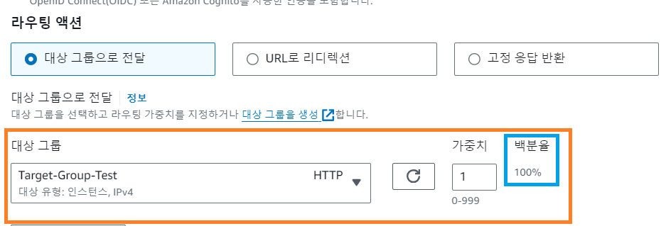

6. 리스너 규칙 추가 및 변경
 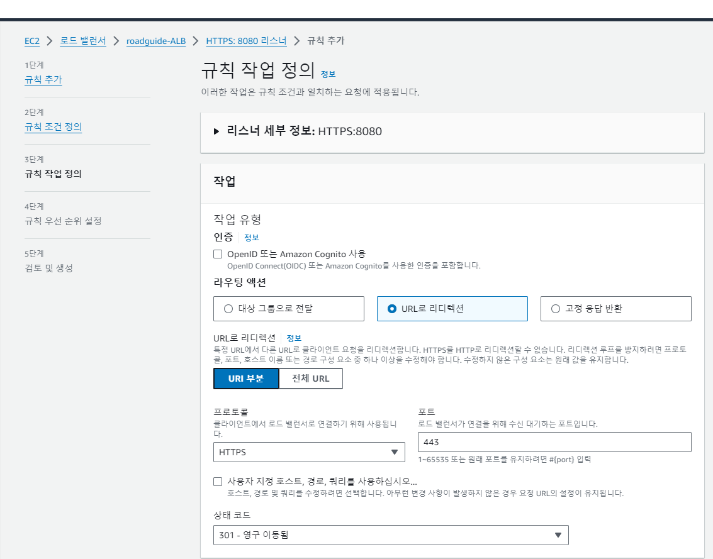
 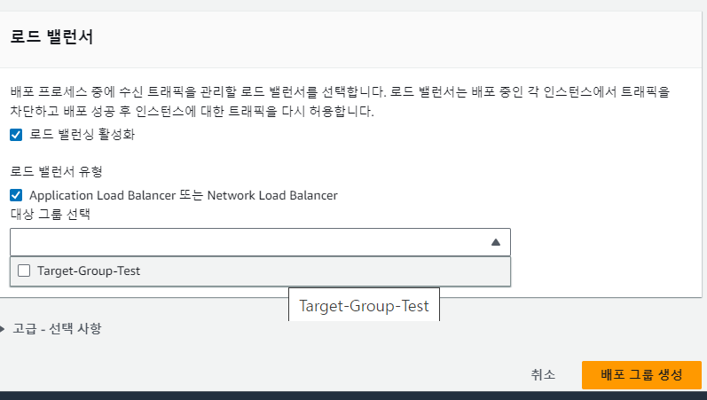

 - 리스너의 룰은 **우선순위**가 있으며, Health Check도 할 수 있다.

##### Health Check 성공하도록 (/) 도메인 요청 시 200 뱉도록 Spring 소스 수정하고, CodeDeploy 배포해보기.

 

 
