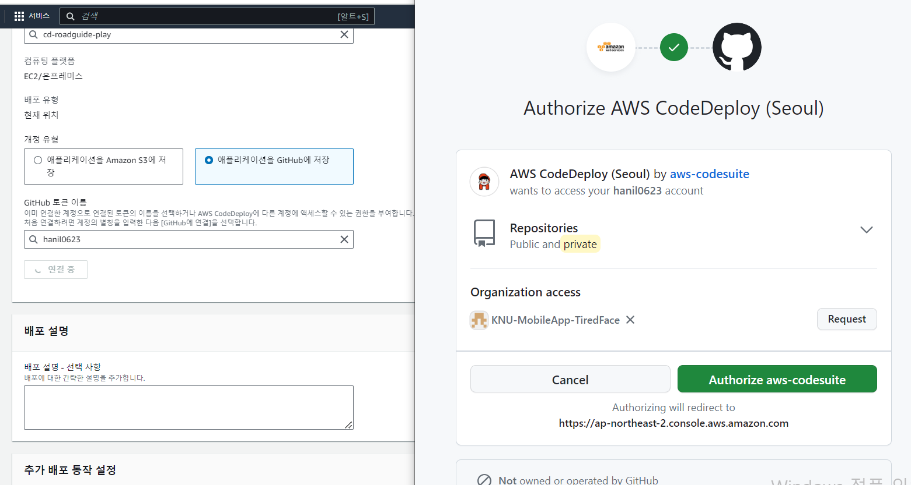
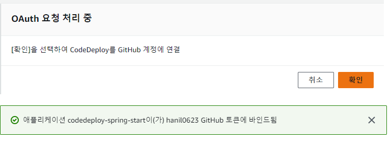
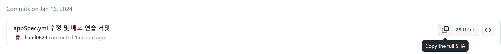
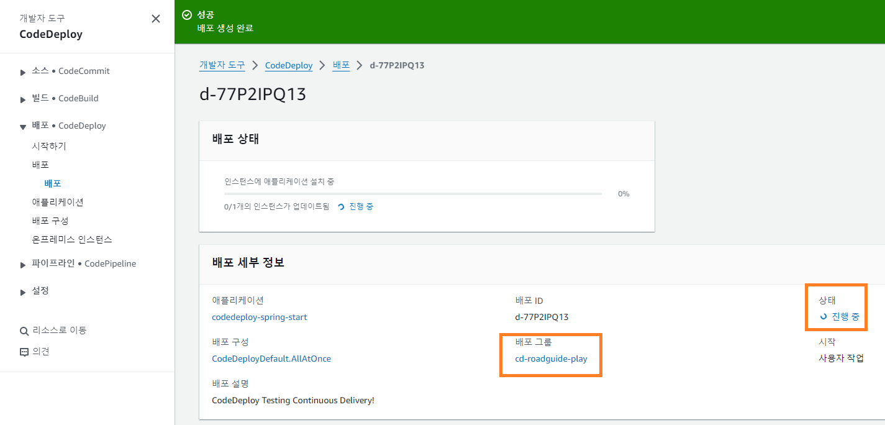
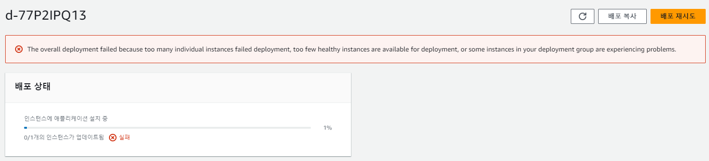
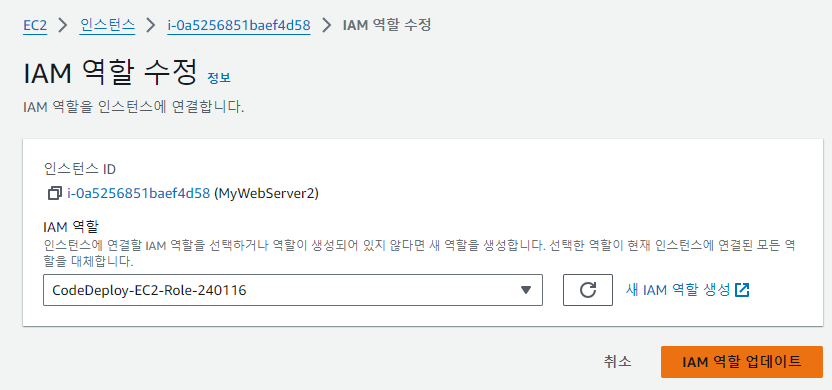

### 240117

### CodeDeploy 배포 시스템 만들기 (2)

목표 : CodeDeploy 애플리케이션 생성 및 실제 배포하기

1. CodeDeploy App 생성

2. App 생성 시, Github 계정과 연결

3. IAM Role 재생성 및 EC2에 연결

### Cannot reach InstanceService: Aws::CodeDeployCommand::Errors::AccessDeniedException 에러 해결 하자..